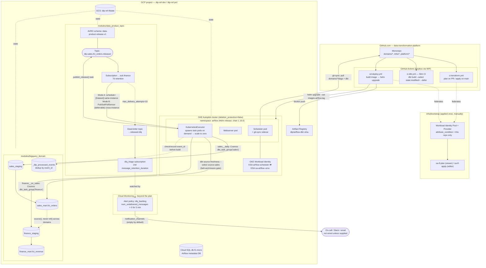
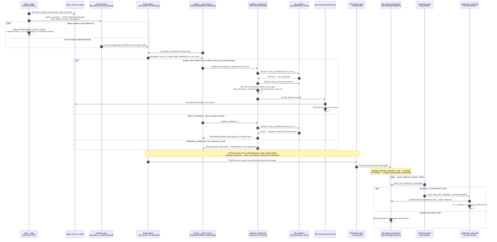

# GKE + Airflow — Detailed Architecture Diagram

> Companion diagram to [Weekend-Project-GKE_AirFlow.md](./Weekend-Project-GKE_AirFlow.md) — the confirmed architecture decision (self-hosted Airflow on GKE Autopilot).
>
> Updated to reflect the DLQ hardening added after the initial build: a `dlq_triage` subscription (bounded retention) plus a Cloud Monitoring alert policy, so dead-lettered messages are inspectable and alertable instead of vanishing or accumulating silently — see [project/README.md](./project/README.md#gaps-filled-beyond-the-plan).

## What each part maps to in the plan

| Diagram element | Plan reference |
|---|---|
| `BOOT` (WIF pool/provider) | Step 1.4 |
| `GKE`/`NS` (scheduler, webserver, KubernetesExecutor, Workload Identity) | Step 3.4, `values-dev.yaml` |
| `SQL` (Cloud SQL metadata DB) | Step 3.4 |
| `PUBSUB` (schema, topic, subscription, DLQ) | Step 3.3 |
| `PUBSUB.DLQSUB` (`dlq_triage` subscription, bounded retention) | Beyond the plan — see project/README.md § Gaps filled |
| `MON` (Cloud Monitoring alert policy on DLQ backlog) | Beyond the plan — requires `monitoring.googleapis.com` enabled (not in the plan's Step 1.2 list) |
| `BQ` (per-domain datasets) | Step 3.2 |
| `EVTBL` (`_dtp_processed_events`) | Step 5.5 (idempotency) |
| Mode A / Mode B on the `SUB → KE` edge | Step 5.4 |
| `source()` boundary between mart layers | Step 4.4 (CI-enforced rule) |
| `CDD` build/deploy flow | Step 6.3 |

## Sequence diagram — cross-domain synchronization

Zooms into the `SUB → KE` edge above. Both signals are always emitted by the
producer (Step 5.3's `publish_release` task carries `outlets=[FCT_ORDERS]`
*and* publishes to Pub/Sub in the same task) — which one a consumer *acts on*
depends on whether it's running `finance__on_sales` (Mode A) or
`finance__event_driven` (Mode B). Mode A has no message envelope to retry or
dead-letter, so the DLQ/retention/alerting path below only exists on the
Mode B side.

**Key points this diagram makes explicit:**

- **Dual signalling is unconditional** — the producer never chooses between Mode A and Mode B; it emits both every run, and each consumer DAG variant decides which one it reacts to (Step 5.3/5.4).
- **Idempotency has two independent guards** — the `_dtp_processed_events` dedup check (Step 5.5) catches Pub/Sub's at-least-once redelivery, while `dbt source freshness` catches "the event said it was fresh but the table actually isn't" (e.g. an event-bus outage or a bug in the publisher).
- **The DLQ path only triggers on repeated, hard failure** — 10 consecutive failed deliveries, not a single transient error — and now has a bounded, monitored lifecycle (`dlq_triage` retention + `dlq_backlog` alert) instead of silently dropping or accumulating messages, per project/README.md § Gaps filled.

