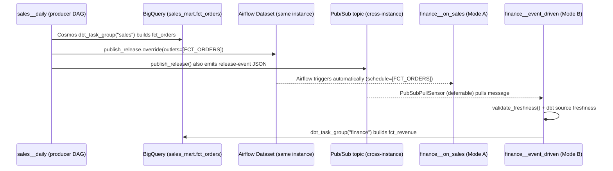

# Cross-Domain Orchestration — How It Works

> Companion note to [Weekend-Project.md](./Weekend-Project.md), explaining how the plan synchronizes autonomous data domains so consumers know when a producer has finished refreshing.

## Overview

Two independent mechanisms work together, layered so the design survives domains moving to separate Airflow instances/projects later:



## 1. The contract: `domain.yaml`

Every domain declares what it **produces** and what it **consumes** (Phase 2 of the plan):

```yaml
produces:
  - name: fct_orders
    topic: dtp.sales.fct_orders.released
consumes:
  - domain: sales
    product: fct_orders
    topic: dtp.sales.fct_orders.released
    max_staleness_hours: 26
```

Terraform reads this same file (`fileset` + `yamldecode` in Step 3.5) to wire IAM readers and Pub/Sub subscriptions — the manifest is the single source of truth for both the runtime dependency and the infrastructure that enforces it.

## 2. Terraform backbone: one Pub/Sub topic per data product

`modules/data_product_topic` (Step 3.3) creates, per product:
- A **topic** (`dtp.sales.fct_orders.released`) bound to an **AVRO schema** (`DataProductRelease`) — this schema *is* the cross-domain data contract (event_id, domain, product, fq_table, logical_date, row_count, status, schema_version).
- One **subscription per consumer domain**, with a **dead-letter topic** after 10 failed delivery attempts and 7-day message retention (so a consumer down for the weekend can still catch up).

## 3. Producer side: dbt finishes → dual signal

The producer DAG (`domains/sales/dags/sales_daily_dag.py`, Step 5.3) runs the dbt models via Cosmos, then — only after the table is committed — calls `publish_release()` (Step 5.2), which does two things simultaneously:
1. **Updates an Airflow Dataset** (`outlets=[FCT_ORDERS]`) — this is what makes same-instance consumer DAGs schedule automatically.
2. **Publishes a JSON event to Pub/Sub**, stamped with `row_count`, `status`, and `logical_date` — this is what survives the producer and consumer living in different Airflow instances/projects.

## 4. Consumer side: two modes, same plan supports both today

- **Mode A** (Step 5.4): `schedule=[FCT_ORDERS]` — zero code, Airflow's scheduler triggers `finance__on_sales` the instant the Dataset is updated. Only works within one Airflow instance.
- **Mode B** (Step 5.4): `PubSubPullSensor` in **deferrable** mode (frees the worker slot while waiting) pulls from the domain's own subscription. This is the mode that keeps working once `finance` moves to its own project/Airflow instance.
- **Belt-and-braces check**: regardless of mode, every consumer run also executes `dbt source freshness --select source:sales` — this turns "the producer said it published" into "the data is actually fresh," so an event-bus outage doesn't silently pass a stale-data run.

## 5. Reliability: making at-least-once delivery safe

Pub/Sub can redeliver, so the plan guards with three rules (Step 5.5):
- A `_dtp_processed_events` table keyed on `event_id` to dedupe.
- Filtering on the `logical_date` message attribute so a run only accepts events for its own run date.
- `max_active_runs=1` on every domain DAG.

## 6. Why it's designed this way for the "future autonomous domains" requirement

Phase 9 (item 3) is the payoff: because both signaling paths exist from day one, splitting a domain into its own repo/project/Airflow instance later is just **deleting the `schedule=[Dataset]` line** — Mode B (Pub/Sub) already does the job and doesn't care which Airflow instance or GCP project either side runs in.
