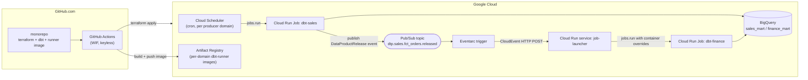

# Reference Data Transformation Platform on GCP — Eventarc + Cloud Run Jobs Variant

> Companion to [Weekend-Project.md](./Weekend-Project.md), which uses Airflow (self-hosted on GKE, or Cloud Composer). This variant replaces the orchestrator entirely with **Eventarc + Cloud Run Jobs** — the same dbt projects, BigQuery domain modules, and Pub/Sub data-product contract are reused unchanged; only the execution/scheduling/triggering layer differs.

## 0. Target architecture

> **Orchestrator choice:** there is no orchestrator running between events in this variant. Each domain's dbt build is a **Cloud Run Job**. Producers are started by **Cloud Scheduler**; consumers are started by **Eventarc**, reacting directly to the same Pub/Sub "data product released" topic the Airflow variant uses. Nothing is ever idle — you pay only for the seconds each Job actually runs.



**Key design decisions (and why):**

| Decision | Choice | Rationale |
|---|---|---|
| Orchestrator | **None** — Cloud Scheduler + Eventarc + Cloud Run Jobs | Zero idle compute between runs; no scheduler/webserver/cluster to keep warm |
| dbt execution model | **One `dbt-runner` image per domain** (own `requirements.txt`, own dbt project baked in), one Cloud Run Job per domain | Every domain is genuinely its own Job/image/service account from day one — no later "container-per-domain" migration needed (unlike the Airflow variant's Phase 9), and domains can pin independent dbt/package versions immediately |
| Cross-domain sync | **Same Pub/Sub `data_product_topic` module and AVRO contract** as the Airflow variant, consumed via **Eventarc** instead of a sensor/Dataset | The contract is orchestrator-agnostic by design; only the trigger mechanism changes |
| Consumer trigger mechanics | Eventarc → small **`job-launcher` Cloud Run service** → calls the Cloud Run Admin API (`jobs.run`) | Cloud Run **Jobs** have no HTTP endpoint to receive events directly; Eventarc can only target request-serving destinations (Cloud Run services, GKE, Workflows), so a thin relay is required |
| GCP → GitHub auth | **Workload Identity Federation** (unchanged from the Airflow variant) | No service account JSON keys ever committed or stored |
| Environments | `dev` + `prd`, same project-per-env pattern as the Airflow variant | Required for a meaningful CI/CD demo |

> ⚠️ **Cost note:** this is the cheapest of the three variants in this repo (Airflow-on-GKE, Composer, this one) — Cloud Run Jobs bill per vCPU-second/memory-second only while executing, Cloud Scheduler and Eventarc have generous free tiers, and there is no cluster, VM, or scheduler process running 24/7 at all.

---

## Phase 1 — Prerequisites and bootstrap (≈30 min)

### Step 1.1 — Decide identifiers

Same as the Airflow variant:

```
ORG/BILLING      : <billing-account-id>
PROJECT (dev)    : dtp-ref-dev
PROJECT (prd)    : dtp-ref-prd
REGION           : europe-central2
GITHUB REPO      : <org>/data-transformation-platform
TF STATE BUCKET  : dtp-ref-tfstate           (created once, lives in dev project)
```

### Step 1.2 — Create projects and enable APIs

```bash
gcloud projects create dtp-ref-dev --name="DTP Reference Dev"
gcloud projects create dtp-ref-prd --name="DTP Reference Prod"

for P in dtp-ref-dev dtp-ref-prd; do
  gcloud beta billing projects link $P --billing-account=$BILLING
  gcloud services enable \
    run.googleapis.com eventarc.googleapis.com cloudscheduler.googleapis.com \
    bigquery.googleapis.com pubsub.googleapis.com \
    artifactregistry.googleapis.com iam.googleapis.com \
    cloudresourcemanager.googleapis.com storage.googleapis.com \
    iamcredentials.googleapis.com sts.googleapis.com \
    datacatalog.googleapis.com --project=$P
done
```

No `container.googleapis.com`, `sqladmin.googleapis.com`, or `composer.googleapis.com` — there is no cluster and no metadata database to run.

### Step 1.3 — Bootstrap Terraform state bucket

Identical to the Airflow variant:

```bash
gcloud storage buckets create gs://dtp-ref-tfstate \
  --project=dtp-ref-dev --location=europe-central2 \
  --uniform-bucket-level-access
gcloud storage buckets update gs://dtp-ref-tfstate --versioning
```

### Step 1.4 — Workload Identity Federation for GitHub Actions

Unchanged from the Airflow variant — see [Weekend-Project.md](./Weekend-Project.md) Step 1.4 for the full `infra/bootstrap/` Terraform. Reuse it as-is.

---

## Phase 2 — Repository structure (≈15 min)

```
data-transformation-platform/
├── .github/
│   └── workflows/
│       ├── ci-terraform.yml
│       ├── ci-dbt.yml
│       └── cd-deploy.yml
├── infra/
│   ├── bootstrap/                  # WIF, state bucket, SAs (unchanged)
│   ├── modules/
│   │   ├── bigquery_domain/        # unchanged from the Airflow variant
│   │   ├── data_product_topic/     # unchanged — same AVRO contract, topic, subscriptions
│   │   ├── dbt_cloud_run_job/      # ← NEW: one Cloud Run Job per domain
│   │   ├── domain_scheduler/       # ← NEW: Cloud Scheduler → jobs.run for producer domains
│   │   ├── job_launcher/           # ← NEW: Eventarc trigger + relay Cloud Run service
│   │   └── domain_identity/        # per-domain SA + role bindings (unchanged)
│   └── envs/
│       ├── dev/{main.tf,backend.tf,terraform.tfvars}
│       └── prd/{main.tf,backend.tf,terraform.tfvars}
├── domains/
│   ├── sales/
│   │   ├── dbt/                    # identical dbt project to the Airflow variant
│   │   ├── domain.yaml             # identical contract manifest
│   │   ├── requirements.txt        # ← NEW: this domain's own dbt-core/dbt-bigquery pin
│   │   └── infra.tf
│   └── finance/
│       └── ...                     # same layout, its own requirements.txt
├── platform/
│   ├── docker/
│   │   └── dbt-runner/
│   │       ├── Dockerfile          # templated: `--build-arg DOMAIN=<name>` produces one independent image per domain
│   │       └── entrypoint.sh       # dbt build + freshness gate + publish_release.py
│   ├── job_launcher/
│   │   ├── main.py                 # tiny Cloud Run service: CloudEvent -> jobs.run
│   │   └── Dockerfile
│   ├── publish_release.py          # shared: builds & publishes the DataProductRelease event
│   └── scripts/
│       └── validate_domain_manifest.py
├── .sqlfluff
├── .pre-commit-config.yaml
└── Makefile
```

`domain.yaml` is untouched — same `produces`/`consumes` contract as [Weekend-Project.md](./Weekend-Project.md) Phase 2.

---

## Phase 3 — Terraform: infrastructure modules (≈1.5 h)

### Step 3.1 — Backend & providers

Same as the Airflow variant, minus the `helm` and `random` providers (not needed here):

```hcl
terraform {
  required_version = ">= 1.9"
  backend "gcs" {
    bucket = "dtp-ref-tfstate"
    prefix = "envs/dev"
  }
  required_providers {
    google = { source = "hashicorp/google", version = "~> 6.0" }
  }
}
```

### Step 3.2 — `modules/bigquery_domain` and `modules/data_product_topic`

**Reused verbatim** from [Weekend-Project.md](./Weekend-Project.md) Steps 3.2 and 3.3 — datasets, IAM, the `data-product-release-v1` AVRO schema, topics, per-consumer subscriptions, and the dead-letter topic are all orchestrator-agnostic and unchanged.

### Step 3.3 — `modules/dbt_cloud_run_job` (replaces `modules/airflow_gke`)

One Cloud Run Job per domain, each running that domain's own `dbt-runner-<domain>` image (built in Step 5.1):

```hcl
resource "google_service_account" "domain_runner" {
  account_id = "sa-dbt-${var.domain}-${var.env}"
}

resource "google_project_iam_member" "domain_runner_roles" {
  for_each = toset(["roles/bigquery.jobUser", "roles/pubsub.publisher"])
  project  = var.project_id
  role     = each.value
  member   = "serviceAccount:${google_service_account.domain_runner.email}"
}

resource "google_cloud_run_v2_job" "dbt" {
  name     = "dbt-${var.domain}-${var.env}"
  location = var.region

  template {
    template {
      service_account = google_service_account.domain_runner.email
      max_retries      = 1
      timeout          = "1800s"

      containers {
        image = "${var.image_repository}:${var.image_tag}"   # e.g. .../dtp/dbt-runner-${var.domain}
        env {
          name  = "GCP_PROJECT"
          value = var.project_id
        }
        env {
          name  = "DTP_ENV"
          value = var.env
        }
        env {
          name  = "DTP_FRESHNESS_SOURCES"
          value = var.freshness_sources   # e.g. "source:sales", empty for domains with no upstream
        }
        resources {
          limits = { cpu = "1", memory = "1Gi" }
        }
      }
    }
  }

  lifecycle {
    ignore_changes = [template[0].template[0].containers[0].image]  # cd-deploy.yml updates the tag directly
  }
}

output "job_name" { value = google_cloud_run_v2_job.dbt.name }
```

### Step 3.4 — `modules/domain_scheduler` (producer trigger — no relay needed)

Cloud Scheduler can call the Cloud Run Admin API directly, since it's a plain authenticated HTTP call:

```hcl
resource "google_service_account" "scheduler" {
  account_id = "sa-scheduler-${var.env}"
}

resource "google_cloud_run_v2_job_iam_member" "scheduler_invoker" {
  name     = var.job_name
  location = var.region
  role     = "roles/run.invoker"
  member   = "serviceAccount:${google_service_account.scheduler.email}"
}

resource "google_cloud_scheduler_job" "producer" {
  name      = "trigger-${var.job_name}"
  region    = var.region
  schedule  = var.cron_schedule        # from domain.yaml's `schedule` field
  time_zone = "Etc/UTC"

  http_target {
    http_method = "POST"
    uri         = "https://${var.region}-run.googleapis.com/v2/projects/${var.project_id}/locations/${var.region}/jobs/${var.job_name}:run"
    oauth_token {
      service_account_email = google_service_account.scheduler.email
    }
  }
}
```

### Step 3.5 — `modules/job_launcher` (consumer trigger — the Eventarc relay)

Cloud Run **Jobs** have no HTTP endpoint, so Eventarc can't target one directly — it targets a small **Cloud Run service** that calls `jobs.run` on the real consumer Job:

```hcl
resource "google_service_account" "launcher" {
  account_id = "sa-job-launcher-${var.env}"
}

# Lets the launcher start any domain's Cloud Run Job execution.
resource "google_project_iam_member" "launcher_run_developer" {
  project = var.project_id
  role    = "roles/run.developer"
  member  = "serviceAccount:${google_service_account.launcher.email}"
}

resource "google_project_iam_member" "launcher_eventarc_receiver" {
  project = var.project_id
  role    = "roles/eventarc.eventReceiver"
  member  = "serviceAccount:${google_service_account.launcher.email}"
}

resource "google_cloud_run_v2_service" "job_launcher" {
  name     = "job-launcher-${var.env}"
  location = var.region

  template {
    service_account = google_service_account.launcher.email
    containers {
      image = "${var.launcher_image_repository}:${var.launcher_image_tag}"
      env {
        name  = "GCP_PROJECT"
        value = var.project_id
      }
    }
  }

  ingress = "INGRESS_TRAFFIC_INTERNAL_ONLY"   # only Eventarc/Pub/Sub can reach it
}

resource "google_cloud_run_v2_service_iam_member" "eventarc_invoker" {
  name     = google_cloud_run_v2_service.job_launcher.name
  location = var.region
  role     = "roles/run.invoker"
  member   = "serviceAccount:${google_service_account.launcher.email}"
}

resource "google_eventarc_trigger" "consumer" {
  for_each        = var.topic_to_job   # map(pubsub_topic_name => target_job_name)
  name            = "trg-${each.value}-${var.env}"
  location        = var.region
  service_account = google_service_account.launcher.email

  matching_criteria {
    attribute = "type"
    value     = "google.cloud.pubsub.topic.v1.messagePublished"
  }

  transport {
    pubsub { topic = each.key }
  }

  destination {
    cloud_run_service {
      service = google_cloud_run_v2_service.job_launcher.name
      region  = var.region
      path    = "/trigger/${each.value}"
    }
  }
}
```

> The launcher receives events for *every* subscribed topic on one shared service, routed by the `/trigger/<job_name>` path — one Cloud Run service is enough for all cross-domain triggers in the whole platform.

---

## Phase 4 — dbt project (≈1.5 h)

**Unchanged from the Airflow variant** — same `dbt_project.yml`, `profiles.yml` (still `method: oauth`, now backed by the Cloud Run Job's attached service account instead of GKE Workload Identity), `generate_schema_name.sql` macro, `_sources.yml` cross-domain `source()` contract, and reference models. See [Weekend-Project.md](./Weekend-Project.md) Phase 4 in full — nothing here depends on the orchestrator.

---

## Phase 5 — Execution and eventing (replaces "Airflow DAGs with Cosmos") (≈1.5 h)

### Step 5.1 — `platform/docker/dbt-runner/Dockerfile`

One templated Dockerfile, built once per domain via `--build-arg DOMAIN=<name>` — each build produces a genuinely independent image containing only that domain's dbt project and its own pinned `requirements.txt`:

```dockerfile
FROM python:3.11-slim
ARG DOMAIN
WORKDIR /app
COPY domains/${DOMAIN}/requirements.txt ./requirements.txt
RUN pip install --no-cache-dir -r requirements.txt \
    google-cloud-pubsub==2.23.0 \
    google-cloud-bigquery==3.27.0
COPY domains/${DOMAIN}/dbt ./dbt
COPY domains/${DOMAIN}/domain.yaml ./domain.yaml
COPY platform/publish_release.py ./publish_release.py
COPY platform/docker/dbt-runner/entrypoint.sh /entrypoint.sh
RUN chmod +x /entrypoint.sh
ENTRYPOINT ["/entrypoint.sh"]
```

`domains/sales/requirements.txt`:

```
dbt-core==1.9.3
dbt-bigquery==1.9.1
```

Because each domain pins its own `requirements.txt`, `finance` can upgrade to a newer dbt-core independently of `sales` — the whole point of option 2.

### Step 5.2 — `platform/docker/dbt-runner/entrypoint.sh`

```bash
#!/usr/bin/env bash
set -euo pipefail

cd /app/dbt
dbt deps --no-write-json

# Belt-and-braces check: refuse to build on stale upstream data (empty for domains with no `consumes`).
if [ -n "${DTP_FRESHNESS_SOURCES:-}" ]; then
  dbt source freshness --select "${DTP_FRESHNESS_SOURCES}"
fi

dbt build --target "${DTP_ENV}"

python /app/publish_release.py
```

The domain is no longer passed in as an env var — the image only ever contains one domain's `dbt/` and `domain.yaml`, so there's nothing to select between.

### Step 5.3 — `platform/publish_release.py`

Same event contract and payload as the Airflow variant's `publish_release()` task — ported to a standalone script since there is no Airflow task context. Cloud Run Jobs set `CLOUD_RUN_EXECUTION` and `CLOUD_RUN_TASK_INDEX` automatically, which stand in for Airflow's `run_id`. Since the image only ever contains one domain, the script reads its own identity from the baked-in `domain.yaml` instead of a CLI argument:

```python
import json, os, uuid, datetime
from google.cloud import pubsub_v1, bigquery
import yaml

def main():
    manifest = yaml.safe_load(open("/app/domain.yaml"))
    domain = manifest["domain"]
    if not manifest.get("produces"):
        return  # consumer-only domain, nothing to publish

    product = manifest["produces"][0]
    project = os.environ["GCP_PROJECT"]
    fq = f"{project}.{product['dataset']}.{product['table']}"

    bq = bigquery.Client()
    rows = bq.get_table(fq).num_rows

    payload = {
        "event_id": str(uuid.uuid4()),
        "domain": domain,
        "product": product["name"],
        "fq_table": fq,
        "logical_date": datetime.date.today().isoformat(),
        "run_id": os.environ.get("CLOUD_RUN_EXECUTION", "local"),
        "dbt_invocation_id": "",
        "row_count": rows,
        "status": "SUCCESS",
        "published_at": datetime.datetime.utcnow().isoformat() + "Z",
        "schema_version": 1,
    }

    publisher = pubsub_v1.PublisherClient()
    topic_path = publisher.topic_path(project, product["topic"])
    publisher.publish(
        topic_path, json.dumps(payload).encode(),
        domain=domain, product=product["name"], logical_date=payload["logical_date"],
    ).result(timeout=30)

if __name__ == "__main__":
    main()
```

### Step 5.4 — `platform/job_launcher/main.py` (the Eventarc relay)

```python
import base64, json, os
from flask import Flask, request
from google.cloud import run_v2

app = Flask(__name__)
jobs_client = run_v2.JobsClient()
PROJECT = os.environ["GCP_PROJECT"]

@app.route("/trigger/<job_name>", methods=["POST"])
def trigger(job_name):
    envelope = request.get_json()
    pubsub_message = envelope["message"]
    data = json.loads(base64.b64decode(pubsub_message["data"]).decode())

    # Region is embedded in the job's fully-qualified name at deploy time.
    region = os.environ["REGION"]
    job_path = jobs_client.job_path(PROJECT, region, job_name)

    jobs_client.run_job(
        request={
            "name": job_path,
            "overrides": {
                "container_overrides": [{
                    "env": [
                        {"name": "DTP_UPSTREAM_EVENT_ID", "value": data["event_id"]},
                        {"name": "DTP_UPSTREAM_LOGICAL_DATE", "value": data["logical_date"]},
                    ]
                }]
            },
        }
    )
    return "", 204

if __name__ == "__main__":
    app.run(host="0.0.0.0", port=int(os.environ.get("PORT", 8080)))
```

`entrypoint.sh` reads `DTP_UPSTREAM_EVENT_ID` and checks it against a `_dtp_processed_events` BigQuery table before running `dbt build`, exactly like the idempotency rule in the Airflow variant's Step 5.5 — Pub/Sub is at-least-once here too, and Eventarc inherits that guarantee.

### Step 5.5 — Idempotency and overlapping executions

Three rules, adapted from the Airflow variant's Step 5.5:
- `_dtp_processed_events` table keyed on `event_id`, checked at the top of `entrypoint.sh` before `dbt build` runs (skip if already processed).
- The launcher passes `logical_date` from the event so the consumer only processes data for that date.
- Unlike Airflow's `max_active_runs=1`, Cloud Run Jobs **do not** automatically serialize executions of the same Job — if the producer's cron and a replayed event could overlap, add an explicit check in `entrypoint.sh` (query `google_cloud_run_v2_job` executions via the Admin API, or rely on the dedup table being sufficient since dbt's `insert_overwrite` incremental strategy is itself idempotent per partition).

---

## Phase 6 — CI/CD with GitHub Actions (≈1.5 h)

### Step 6.1 — `ci-terraform.yml`

Identical structure to the Airflow variant (plan on PR, apply on merge to `main`, WIF auth, `dev`/`prd` matrix) — see [Weekend-Project.md](./Weekend-Project.md) Step 6.1. No changes needed; the module names differ but the workflow logic doesn't care.

### Step 6.2 — `ci-dbt.yml`

Identical Slim CI pattern to the Airflow variant (per-changed-domain matrix, `dbt build --select state:modified+ --defer --state ./prod_manifest`, PR-scoped dataset cleanup) — see [Weekend-Project.md](./Weekend-Project.md) Step 6.2. Unchanged.

### Step 6.3 — `cd-deploy.yml` (main → Cloud Run Jobs)

Simpler than either Airflow variant's deploy step — there's no DAG sync and no Helm release, just one image build/push per domain and a matching job update:

```yaml
name: cd-deploy
on: { push: { branches: [main], paths: ["domains/**", "platform/**"] } }

permissions: { contents: read, id-token: write }

jobs:
  deploy:
    strategy: { max-parallel: 1, matrix: { env: [dev, prd] } }
    environment: ${{ matrix.env }}
    runs-on: ubuntu-latest
    steps:
      - uses: actions/checkout@v4
      - uses: google-github-actions/auth@v2
        with:
          workload_identity_provider: ${{ secrets.WIF_PROVIDER }}
          service_account: ${{ secrets.SA_DEPLOY }}
      - uses: google-github-actions/setup-gcloud@v2

      - name: Build and push one dbt-runner image per domain
        run: |
          gcloud auth configure-docker europe-central2-docker.pkg.dev --quiet
          for d in domains/*/; do
            n=$(basename $d)
            IMAGE=europe-central2-docker.pkg.dev/dtp-ref-${{ matrix.env }}/dtp/dbt-runner-${n}:${{ github.sha }}
            docker build --build-arg DOMAIN=$n -t $IMAGE -f platform/docker/dbt-runner/Dockerfile .
            docker push $IMAGE
          done

      - name: Update each domain's Cloud Run Job
        run: |
          for d in domains/*/; do
            n=$(basename $d)
            gcloud run jobs update "dbt-${n}-${{ matrix.env }}" \
              --region europe-central2 \
              --image "europe-central2-docker.pkg.dev/dtp-ref-${{ matrix.env }}/dtp/dbt-runner-${n}:${{ github.sha }}"
          done

      - name: Publish manifests for next PR's Slim CI
        if: matrix.env == 'prd'
        run: |
          for d in domains/*/; do
            n=$(basename $d)
            gcloud storage cp $d/dbt/target/manifest.json \
              gs://dtp-ref-artifacts/manifests/$n/prd/manifest.json
          done

      - name: Smoke test — producer job runs cleanly
        run: |
          gcloud run jobs execute dbt-sales-${{ matrix.env }} --region europe-central2 --wait
```

### Step 6.4 — Branch protection & pre-commit

Unchanged from the Airflow variant.

---

## Phase 7 — Deployment runbook (order matters)

| # | Action | Where | Notes |
|---|---|---|---|
| 1 | Create projects, enable APIs, create state bucket | local `gcloud` | one-time |
| 2 | `terraform apply` in `infra/bootstrap/` | local | creates WIF pool, provider, CI service accounts |
| 3 | Add repo secrets `WIF_PROVIDER`, `SA_TF_PLAN`, `SA_TF_APPLY`, `SA_DBT_CI`, `SA_DEPLOY` | GitHub | values are TF outputs |
| 4 | Push `infra/envs/dev` → merge | GitHub | **Cloud Run Jobs + Eventarc triggers + Scheduler provision in well under a minute** |
| 5 | While waiting: build dbt models, run `dbt build --target dev` locally | local | validates BQ access + SQL |
| 6 | Create GitHub Environments `dev` / `prd`, add reviewer on `prd` | GitHub | gates prod apply |
| 7 | Merge domains + platform code → `cd-deploy` runs | GitHub | builds/pushes image, updates each domain's Job |
| 8 | Manually execute the producer job | `gcloud run jobs execute dbt-sales-dev --region europe-central2 --wait` | verify dbt build + event publish succeed |
| 9 | Confirm the consumer job auto-executes | `gcloud run jobs executions list --job=dbt-finance-dev --region europe-central2` | **proves the Eventarc-triggered sync** |
| 10 | Confirm Pub/Sub message landed | `gcloud pubsub subscriptions pull` | **proves the cross-project contract still holds** |
| 11 | Open a PR touching one model → observe Slim CI | GitHub | proves `state:modified+ --defer` |
| 12 | Apply `infra/envs/prd`, approve, deploy | GitHub | full promotion path |

---

## Phase 8 — Validation checklist

```bash
# IaC: zero drift after deploy
terraform -chdir=infra/envs/dev plan -detailed-exitcode   # expect exit 0

# BigQuery: partitioning and labels actually applied
bq show --format=prettyjson dtp-ref-dev:sales_mart.fct_orders | jq '.timePartitioning, .labels'

# dbt: full graph builds + tests pass
cd domains/sales/dbt && dbt build --target dev && dbt test

# Cloud Run: producer → consumer chain
gcloud run jobs executions list --job=dbt-finance-dev --region europe-central2 --limit=5

# Eventarc: trigger is healthy and wired to the right topic
gcloud eventarc triggers describe trg-dbt-finance-dev-dev --location europe-central2

# Synchronization: event published with correct contract
gcloud pubsub subscriptions pull dtp.sales.fct_orders.released.sub.finance --auto-ack --limit 1

# Freshness contract holds
cd domains/finance/dbt && dbt source freshness --select source:sales
```

---

## Phase 9 — How this scales to autonomous domain projects

This variant needs **fewer** migration steps than the Airflow-on-GKE variant, because per-domain isolation already exists on day one:

1. **`git filter-repo` the `domains/<name>/` folder** into its own repo — identical to the Airflow variant.
2. **No execution-mode migration needed.** Each domain is already its own Cloud Run Job, image, and service account — there's no shared scheduler/worker pool to split apart, unlike Cosmos-in-Airflow's Phase 9 step 2.
3. **The Pub/Sub + Eventarc contract already crosses process/project boundaries** — nothing to cut over, unlike Airflow's Dataset→Pub/Sub migration.
4. **Move the contract manifests to a registry**, same as the Airflow variant, so consumers discover producers without reading another team's repo.
5. **Separate GCP projects per domain**, with cross-project Eventarc triggers (supported: the trigger's Pub/Sub topic can live in a different project than the destination Cloud Run service) and `roles/bigquery.dataViewer` granted cross-project on mart datasets only.

---

## Phase 10 — Teardown (do this Sunday night)

```bash
terraform -chdir=infra/envs/prd destroy
terraform -chdir=infra/envs/dev destroy     # Cloud Run Jobs/services + Eventarc + Scheduler, seconds
```

This is the fastest teardown/rebuild cycle of the three variants in this repo — there's no cluster or managed environment to wait on in either direction.

---

## Weekend timebox

| Slot | Work |
|---|---|
| Sat AM (2.5 h) | Phases 1–3: bootstrap, repo skeleton, Terraform modules (infra provisions in seconds, so no need to front-load it) |
| Sat PM (3 h) | Phase 4: dbt projects for `sales` + `finance`, local `dbt build` green |
| Sat eve (2 h) | Phase 5: dbt-runner image, entrypoint script, `publish_release.py`, `job_launcher` service |
| Sun AM (2.5 h) | Phase 6: three GitHub Actions workflows, WIF secrets, branch protection |
| Sun PM (2 h) | Phases 7–8: end-to-end deploy + validation checklist |
| Sun eve (1 h) | README/ADR notes, Phase 10 teardown |

## Highest-risk items (budget buffer here)

1. **Eventarc → Cloud Run Job requires a relay service** — a common first mistake is assuming Eventarc can target a Job directly. It can't (Jobs have no HTTP endpoint); budget time for the `job_launcher` service and its IAM (`roles/run.developer`, `roles/eventarc.eventReceiver`, plus `roles/run.invoker` on itself for Eventarc to call it).
2. **No automatic execution serialization** — Cloud Run Jobs don't have Airflow's `max_active_runs=1`; overlapping executions of the same Job are possible if a producer's cron fires while a manual rerun is still in flight. Rely on the `_dtp_processed_events` dedup table and dbt's idempotent `insert_overwrite` strategy.
3. **CloudEvent payload decoding** — the `job_launcher`'s Pub/Sub message is base64-encoded inside a nested `message.data` field; a wrong decode path fails silently as a 4xx from Eventarc's retry, not a visible error in your dbt logs. Test with `gcloud pubsub topics publish` directly against the topic before wiring the full trigger.
4. **Cold start latency** — Cloud Run Jobs take a few seconds to tens of seconds to start an execution; fine for a weekend demo, but don't expect Airflow's warm-worker responsiveness.
5. **No Cosmos-equivalent per-model granularity** — Cosmos is an Airflow-only library; with no Airflow scheduler in this variant, `dbt build` runs as one opaque invocation per domain per execution. A single failed model retries the *whole* domain build (Step 3.3's `max_retries`), and there's no per-model Gantt/log view — only dbt's own console output inside one Cloud Logging stream. Partially recoverable by parsing `target/run_results.json` and re-running with `--select result:error+` instead of a full retry.
6. **WIF `attribute_condition`** — omit it and your GitHub Actions pool trusts every repo on GitHub. Non-negotiable, same as every variant in this repo.
