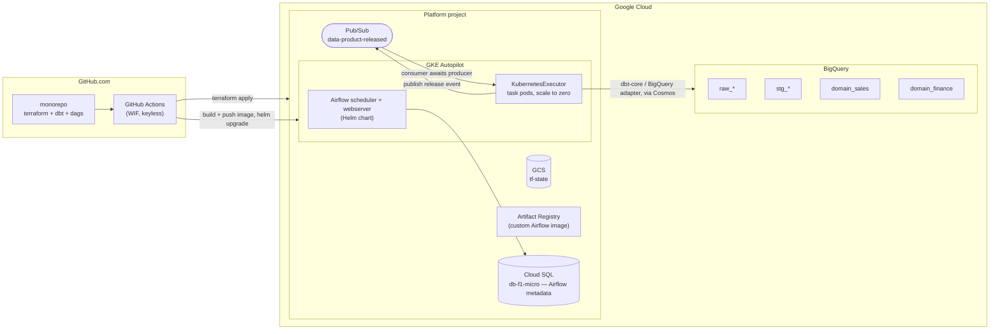

# Platforma transformacji danych referencyjnych w GCP — plan wdrożenia i implementacji

## 0. Architektura docelowa

> **Wybór orkiestratora:** ten plan uruchamia Airflow **self-hosted na GKE Autopilot** (Helm chart + `KubernetesExecutor`) jako ścieżkę główną — tylko pody schedulera i webservera działają non-stop, a pody zadań skalują się do zera między uruchomieniami, co jest istotnie tańsze niż Cloud Composer w budowie weekendowej. Composer pozostaje w pełni wykonalny i jest udokumentowany jako zamiennik zarządzany w Załączniku A na końcu dokumentu.



**Kluczowe decyzje projektowe (i dlaczego):**

| Decyzja | Wybór | Uzasadnienie |
|---|---|---|
| Topologia repozytorium | **Monorepo teraz, CI z zakresem ścieżek** | Zakres weekendowy; foldery per-domena są już „gotowe do wydzielenia” — każda domena może zostać później wyodrębniona do własnego repo bez refaktoryzacji. |
| Orkiestrator | **Self-hosted Airflow na GKE Autopilot** (`KubernetesExecutor`); Cloud Composer udokumentowany jako zarządzany alternatywny wariant | Brak opłaty 24/7 za Composer; pody zadań są rozliczane tylko podczas działania — odpowiedni kształt dla prac weekendowych o zmiennym obciążeniu. |
| Model wykonania dbt | **astronomer-cosmos wewnątrz podów schedulera/workerów (faza 1) → jedna obraz dbt na domenę przez `ExecutionMode.KUBERNETES` (faza 2)** | Cosmos zapewnia granulat zadań na poziomie modeli oraz retry natychmiast. Kontenery per domena to docelowy stan autonomii (niezależne wersje dbt i pakietów). |
| Synchronizacja między domenami | **Airflow Assets/Datasets wewnątrz instancji + zdarzenia Pub/Sub „data product released” między instancjami** | Datasets = planowanie zależności bez kodu. Pub/Sub = kontrakt, który przetrwa rozdzielenie domen do różnych projektów/instancji Airflow. |
| Autoryzacja GCP → GitHub | **Workload Identity Federation** (GitHub Actions) + **GKE Workload Identity** (pody w klastrze) | Nigdy nie ma kluczy kont serwisowych zapisanych ani commitowanych. |
| Środowiska | `dev` + `prd`, osobne projekty GCP (lub co najmniej osobne zestawy danych + osobne prefiksy stanu TF) | Wymagane dla sensownego demo CI/CD. |

> ⚠️ **Uwaga o kosztach:** ścieżka GKE też nie jest darmowa — płacisz za żądania podów Autopilot scheduler/webserver, instancję Cloud SQL `db-f1-micro` oraz pody zadań podczas ich działania. To ułamek kosztu Composer z podłogą 24/7, ale nadal warto uruchomić `terraform destroy` w niedzielę wieczorem (Krok 10), aby nie ponosić stałych kosztów między weekendami.

---

## Faza 1 — Wymagania wstępne i inicjalizacja (≈45 min)

### Krok 1.1 — Określenie identyfikatorów

Ustal je od razu; przechodzą przez całą konfigurację:

```
ORG/BILLING      : <billing-account-id>
PROJECT (dev)    : dtp-ref-dev
PROJECT (prd)    : dtp-ref-prd
REGION           : europe-central2
GITHUB REPO      : <org>/data-transformation-platform
TF STATE BUCKET  : dtp-ref-tfstate           (utworzony raz, istnieje w projekcie dev)
```

### Krok 1.2 — Utworzenie projektów i włączenie API

```bash
gcloud projects create dtp-ref-dev --name="DTP Reference Dev"
gcloud projects create dtp-ref-prd --name="DTP Reference Prod"

for P in dtp-ref-dev dtp-ref-prd; do
  gcloud beta billing projects link $P --billing-account=$BILLING
  gcloud services enable \
    container.googleapis.com sqladmin.googleapis.com bigquery.googleapis.com pubsub.googleapis.com \
    artifactregistry.googleapis.com iam.googleapis.com \
    cloudresourcemanager.googleapis.com storage.googleapis.com \
    iamcredentials.googleapis.com sts.googleapis.com \
    datacatalog.googleapis.com --project=$P
done
```

### Krok 1.3 — Inicjalizacja bucketa stanu Terraform (jedyny click-op, którego dopuścisz)

```bash
gcloud storage buckets create gs://dtp-ref-tfstate \
  --project=dtp-ref-dev --location=europe-central2 \
  --uniform-bucket-level-access
gcloud storage buckets update gs://dtp-ref-tfstate --versioning
```

### Krok 1.4 — Workload Identity Federation dla GitHub Actions

Zainicjuj to małym, samodzielnym stackiem Terraform (`infra/bootstrap/`), aby nadal było to IaC:

```hcl
resource "google_iam_workload_identity_pool" "github" {
  workload_identity_pool_id = "github-pool"
}

resource "google_iam_workload_identity_pool_provider" "github" {
  workload_identity_pool_id          = google_iam_workload_identity_pool.github.workload_identity_pool_id
  workload_identity_pool_provider_id = "github-provider"
  attribute_mapping = {
    "google.subject"       = "assertion.sub"
    "attribute.repository" = "assertion.repository"
    "attribute.ref"        = "assertion.ref"
  }
  # Hard requirement: without attribute_condition the pool accepts ANY GitHub repo.
  attribute_condition = "assertion.repository == '<org>/data-transformation-platform'"
  oidc { issuer_uri = "https://token.actions.githubusercontent.com" }
}

# Two SAs: plan-only (PR) and apply (main)
resource "google_service_account" "tf_plan"  { account_id = "sa-tf-plan"  }
resource "google_service_account" "tf_apply" { account_id = "sa-tf-apply" }

resource "google_service_account_iam_member" "apply_wif" {
  service_account_id = google_service_account.tf_apply.name
  role               = "roles/iam.workloadIdentityUser"
  member             = "principalSet://iam.googleapis.com/${google_iam_workload_identity_pool.github.name}/attribute.repository/<org>/data-transformation-platform"
}
```

Przyznaj `sa-tf-plan` → `roles/viewer`; `sa-tf-apply` → `roles/editor` + `roles/iam.securityAdmin` (zwiększ bezpieczeństwo później). Ogranicz dodatkowo `sa-tf-apply`, dodając warunek `attribute.ref == 'refs/heads/main'` do powiązania, jeśli chcesz czyste demo least privilege.

---

## Faza 2 — Struktura repozytorium (≈20 min)

Zaprojektuj układ tak, aby „wyodrębnienie domeny do własnego repo” było `git mv`, a nie przebudową.

```
data-transformation-platform/
├── .github/
│   └── workflows/
│       ├── ci-terraform.yml
│       ├── ci-dbt.yml
│       └── cd-deploy.yml
├── infra/
│   ├── bootstrap/                  # WIF, state bucket, SAs  (aplikowane raz, ręcznie)
│   ├── modules/
│   │   ├── bigquery_domain/        # zestawy danych + IAM dla jednej domeny
│   │   ├── airflow_gke/            # klaster GKE Autopilot + Cloud SQL + Helm release
│   │   ├── data_product_topic/     # temat Pub/Sub + schema + subskrypcje
│   │   └── domain_identity/        # SA na domenę + powiązania ról
│   └── envs/
│       ├── dev/{main.tf,backend.tf,terraform.tfvars}
│       └── prd/{main.tf,backend.tf,terraform.tfvars}
├── domains/
│   ├── sales/                      # ← autonomiczna jednostka
│   │   ├── dbt/                    # pełny, samodzielny projekt dbt
│   │   │   ├── dbt_project.yml
│   │   │   ├── profiles.yml
│   │   │   ├── packages.yml
│   │   │   ├── models/{staging,intermediate,marts}/
│   │   │   ├── macros/
│   │   │   ├── seeds/
│   │   │   └── tests/
│   │   ├── dags/
│   │   │   └── sales_daily_dag.py
│   │   ├── domain.yaml             # ← manifest kontraktu domeny
│   │   └── infra.tf                # wywołania modułów tylko dla tej domeny
│   └── finance/                    # druga domena: konsumuje sales
│       └── ...
├── platform/
│   ├── dags_common/                # współdzielone helpery Airflow (instalowane jako plugin)
│   │   ├── data_product.py         # publikacja/oczekiwanie na zdarzenia release
│   │   └── cosmos_factory.py       # fabryka build_dbt_dag(domain)
│   ├── docker/
│   │   └── airflow/
│   │       └── Dockerfile          # baza apache/airflow + cosmos + dbt-bigquery
│   ├── helm/
│   │   └── airflow/
│   │       ├── values-dev.yaml
│   │       └── values-prd.yaml
│   └── scripts/
│       ├── deploy_airflow.sh       # gcloud get-credentials + helm upgrade
│       └── validate_domain_manifest.py
├── .sqlfluff
├── .pre-commit-config.yaml
└── Makefile
```

`domain.yaml` jest sercem wymogu „przyszłe autonomiczne domeny”:

```yaml
# domains/sales/domain.yaml
domain: sales
owner: sales-data-team@example.com
schedule: "0 3 * * *"
dbt:
  project_dir: domains/sales/dbt
  target_dataset_prefix: sales
produces:                      # data products this domain publishes
  - name: fct_orders
    dataset: sales_mart
    table: fct_orders
    sla_minutes: 120
    topic: dtp.sales.fct_orders.released
consumes:                      # upstream products this domain waits for
  []
```

```yaml
# domains/finance/domain.yaml
domain: finance
schedule: null                 # event-driven only
produces:
  - name: fct_revenue
    dataset: finance_mart
    table: fct_revenue
    topic: dtp.finance.fct_revenue.released
consumes:
  - domain: sales
    product: fct_orders
    topic: dtp.sales.fct_orders.released
    max_staleness_hours: 26
```

Oba CI (walidacja, renderowanie grafu zależności) i Terraform (przez `yamldecode`) odczytują ten plik — jedna źródłowa prawda.

---

## Faza 3 — Terraform: moduły infrastruktury (≈2 h)

### Krok 3.1 — Backend i dostawcy (`infra/envs/dev/backend.tf`)

```hcl
terraform {
  required_version = ">= 1.9"
  backend "gcs" {
    bucket = "dtp-ref-tfstate"
    prefix = "envs/dev"
  }
  required_providers {
    google = { source = "hashicorp/google", version = "~> 6.0" }
  }
}
```

### Krok 3.2 — `modules/bigquery_domain`

Jeden wywołany moduł na domenę na warstwę; utrzymuje spójne nazewnictwo zestawów danych i dostępów.

```hcl
variable "domain"      { type = string }
variable "env"         { type = string }
variable "location"    { type = string }
variable "layers"      { type = list(string), default = ["staging", "mart"] }
variable "reader_members" { type = list(string), default = [] }

resource "google_bigquery_dataset" "this" {
  for_each      = toset(var.layers)
  dataset_id    = "${var.domain}_${each.value}"
  location      = var.location
  description   = "Domain ${var.domain} — ${each.value} layer (${var.env})"
  delete_contents_on_destroy = var.env == "dev"

  labels = {
    domain = var.domain
    layer  = each.value
    env    = var.env
    managed_by = "terraform"
  }

  default_partition_expiration_ms = each.value == "staging" ? 7776000000 : null  # 90d on staging only
}

# Producer-owned write access; consumers only ever get reader on the mart layer.
resource "google_bigquery_dataset_iam_member" "domain_writer" {
  for_each   = google_bigquery_dataset.this
  dataset_id = each.value.dataset_id
  role       = "roles/bigquery.dataEditor"
  member     = "serviceAccount:${var.domain_sa_email}"
}

resource "google_bigquery_dataset_iam_member" "consumers" {
  for_each   = toset(var.reader_members)
  dataset_id = google_bigquery_dataset.this["mart"].dataset_id
  role       = "roles/bigquery.dataViewer"
  member     = each.value
}
```

### Krok 3.3 — `modules/data_product_topic` (rdzeń synchronizacji)

```hcl
resource "google_pubsub_schema" "release_event" {
  name = "data-product-release-v1"
  type = "AVRO"
  definition = file("${path.module}/release_event.avsc")
}

resource "google_pubsub_topic" "product" {
  name = var.topic_name                       # dtp.sales.fct_orders.released
  schema_settings {
    schema   = google_pubsub_schema.release_event.id
    encoding = "JSON"
  }
  message_retention_duration = "604800s"      # 7 days: lets a down consumer catch up
  labels = { domain = var.domain, product = var.product }
}

resource "google_pubsub_subscription" "consumer" {
  for_each = toset(var.consumer_domains)
  name     = "${var.topic_name}.sub.${each.value}"
  topic    = google_pubsub_topic.product.id
  ack_deadline_seconds       = 60
  message_retention_duration = "604800s"
  retain_acked_messages      = false
  expiration_policy { ttl = "" }              # never expire
  dead_letter_policy {
    dead_letter_topic     = google_pubsub_topic.dlq.id
    max_delivery_attempts = 10
  }
}
```

`release_event.avsc` — **to jest Twój kontrakt danych**:

```json
{
  "type": "record", "name": "DataProductRelease",
  "fields": [
    {"name": "event_id",        "type": "string"},
    {"name": "domain",          "type": "string"},
    {"name": "product",         "type": "string"},
    {"name": "fq_table",        "type": "string"},
    {"name": "logical_date",    "type": "string"},
    {"name": "run_id",          "type": "string"},
    {"name": "dbt_invocation_id","type": "string"},
    {"name": "row_count",       "type": "long"},
    {"name": "status",          "type": {"type":"enum","name":"Status","symbols":["SUCCESS","PARTIAL","FAILED"]}},
    {"name": "published_at",    "type": "string"},
    {"name": "schema_version",  "type": "int"}
  ]
}
```

### Krok 3.4 — `modules/airflow_gke` (self-hosted Airflow na GKE Autopilot)

GKE Autopilot + mała baza danych Cloud SQL do metadanych + release Helm z oficjalnego chartu Airflow, podłączone przez GKE Workload Identity — bez kluczy nigdzie.

```hcl
resource "google_container_cluster" "airflow" {
  name                = "airflow-${var.env}"
  location            = var.region
  enable_autopilot    = true
  deletion_protection = false        # weekend project: teardown must be one command
  ip_allocation_policy {}            # required for Autopilot (VPC-native)
}

resource "google_sql_database_instance" "airflow_meta" {
  name                = "airflow-meta-${var.env}"
  database_version    = "POSTGRES_15"
  region              = var.region
  deletion_protection = false
  settings {
    tier              = "db-f1-micro"   # cheapest managed tier, fine for a demo
    availability_type = "ZONAL"
  }
}

resource "google_sql_database" "airflow" {
  name     = "airflow"
  instance = google_sql_database_instance.airflow_meta.name
}

resource "random_password" "airflow_db" {
  length  = 24
  special = false
}

resource "google_sql_user" "airflow" {
  name     = "airflow"
  instance = google_sql_database_instance.airflow_meta.name
  password = random_password.airflow_db.result
}

resource "google_service_account" "airflow_gsa" {
  account_id = "sa-airflow-${var.env}"
}

resource "google_project_iam_member" "airflow_roles" {
  for_each = toset([
    "roles/bigquery.jobUser",
    "roles/pubsub.publisher",
    "roles/pubsub.subscriber",
    "roles/cloudsql.client",
  ])
  project = var.project_id
  role    = each.value
  member  = "serviceAccount:${google_service_account.airflow_gsa.email}"
}

# Binds the in-cluster KSA to this GSA — GKE Workload Identity, no key ever leaves GCP.
resource "google_service_account_iam_member" "workload_identity" {
  service_account_id = google_service_account.airflow_gsa.name
  role                = "roles/iam.workloadIdentityUser"
  member              = "serviceAccount:${var.project_id}.svc.id.goog[airflow/airflow-scheduler]"
}

resource "helm_release" "airflow" {
  name             = "airflow"
  repository       = "https://airflow.apache.org"
  chart            = "airflow"
  version          = "1.16.0"          # chart's own default Airflow image is 2.10.5 here - matches the Dockerfile below
  namespace        = "airflow"
  create_namespace = true
  values           = [file("${path.module}/../../../platform/helm/airflow/values-${var.env}.yaml")]

  set_sensitive {
    name  = "data.metadataConnection.pass"
    value = random_password.airflow_db.result
  }

  depends_on = [google_container_cluster.airflow, google_sql_database.airflow, google_sql_user.airflow]
}

output "gke_cluster_name"  { value = google_container_cluster.airflow.name }
output "airflow_gsa_email" { value = google_service_account.airflow_gsa.email }
```

> Dodaj dostawcę `hashicorp/random` i `helm` (`terraform-providers/helm`) do `required_providers` w `backend.tf` przed planowaniem tego modułu.
>
> Chart `1.20.0`+ przestał wspierać wersje Airflow poniżej 2.11, więc trzymaj się wersji `1.19.0` lub niższej przy podpięciu obrazu `2.10.5` poniżej; zaktualizuj obraz bazowy w Dockerfile przed przejściem poza tę wersję chartu.

`platform/helm/airflow/values-dev.yaml`:

```yaml
executor: KubernetesExecutor       # task pods scale to zero between runs
images:
  airflow:
    repository: europe-central2-docker.pkg.dev/dtp-ref-dev/dtp/airflow-dbt
    tag: latest                    # CI pins the real tag via `helm upgrade --set images.airflow.tag=<sha>`
webserver:
  replicas: 1
  resources: { requests: { cpu: "250m", memory: "512Mi" } }
scheduler:
  replicas: 1
  resources: { requests: { cpu: "250m", memory: "512Mi" } }
triggerer:
  enabled: false                   # enable only if you use deferrable sensors (PubSubPullSensor deferrable=True)
postgresql:
  enabled: false                   # use external Cloud SQL, not the chart's bundled Postgres
data:
  metadataConnection:
    protocol: postgresql
    host: 127.0.0.1                # via Cloud SQL Auth Proxy sidecar
    user: airflow
    db: airflow
    port: 5432
workers:
  resources: { requests: { cpu: "250m", memory: "512Mi" } }
dags:
  gitSync:
    enabled: true
    repo: https://github.com/<org>/data-transformation-platform.git
    branch: main
    subPath: "domains"
serviceAccount:
  create: true
  name: airflow-scheduler
  annotations:
    iam.gke.io/gcp-service-account: sa-airflow-dev@dtp-ref-dev.iam.gserviceaccount.com
```

`platform/docker/airflow/Dockerfile`:

```dockerfile
FROM apache/airflow:2.10.5-python3.11
RUN pip install --no-cache-dir \
    astronomer-cosmos==1.9.2 \
    dbt-bigquery==1.9.1 \
    dbt-core==1.9.3
```

> ⏱ Utworzenie klastra GKE Autopilot + Cloud SQL trwa około 5–10 minut — dużo szybciej niż Composer, ale nadal uruchom je najpierw, podczas gdy budujesz projekty dbt.

### Krok 3.5 — Kompozycja środowisk (`infra/envs/dev/main.tf`)

Steruj wszystkim z `domain.yaml`, więc dodanie domeny = dodanie folderu:

```hcl
locals {
  domain_files = fileset("${path.module}/../../../domains", "*/domain.yaml")
  domains      = { for f in local.domain_files :
                   yamldecode(file("${path.module}/../../../domains/${f}")).domain =>
                   yamldecode(file("${path.module}/../../../domains/${f}")) }

  products = flatten([for d, cfg in local.domains :
              [for p in cfg.produces : merge(p, { domain = d })]])

  consumers_by_topic = { for t in distinct([for p in local.products : p.topic]) :
                          t => [for d, cfg in local.domains :
                                d if contains([for c in try(cfg.consumes, []) : c.topic], t)] }
}

module "domain_identity" {
  for_each = local.domains
  source   = "../../modules/domain_identity"
  domain   = each.key
  project_id = var.project_id
}

module "bigquery" {
  for_each        = local.domains
  source          = "../../modules/bigquery_domain"
  domain          = each.key
  env             = var.env
  location        = var.location
  domain_sa_email = module.domain_identity[each.key].sa_email
  reader_members  = [for d, cfg in local.domains :
                     "serviceAccount:${module.domain_identity[d].sa_email}"
                     if contains([for c in try(cfg.consumes, []) : c.domain], each.key)]
}

module "product_topic" {
  for_each         = { for p in local.products : p.topic => p }
  source           = "../../modules/data_product_topic"
  topic_name       = each.key
  domain           = each.value.domain
  product          = each.value.name
  consumer_domains = lookup(local.consumers_by_topic, each.key, [])
}
```

To jest najważniejszy ruch strukturalny: **graf zależności między domenami jest deklarowany w YAML i materializowany jako infrastruktura**, więc nic nie jest ręcznie podpinane.

---

## Faza 4 — projekt dbt (≈1.5 h)

### Krok 4.1 — `domains/sales/dbt/dbt_project.yml`

```yaml
name: sales
version: "1.0.0"
config-version: 2
profile: sales

model-paths: ["models"]
target-path: "target"

vars:
  gcp_project: "{{ env_var('GCP_PROJECT') }}"
  dtp_env: "{{ env_var('DTP_ENV', 'dev') }}"

models:
  sales:
    +persist_docs: {relation: true, columns: true}
    staging:
      +materialized: view
      +schema: staging
    intermediate:
      +materialized: ephemeral
    marts:
      +materialized: incremental
      +incremental_strategy: insert_overwrite
      +partition_by: {field: order_date, data_type: date, granularity: day}
      +schema: mart
      +labels: {domain: sales, layer: mart}
```

### Krok 4.2 — `profiles.yml` (bez kluczy, używa GKE Workload Identity ADC)

```yaml
sales:
  target: "{{ env_var('DTP_ENV', 'dev') }}"
  outputs:
    dev:
      type: bigquery
      method: oauth               # Application Default Credentials
      project: "{{ env_var('GCP_PROJECT') }}"
      dataset: sales_staging
      location: "{{ env_var('DTP_BQ_LOCATION', 'europe-central2') }}"
      threads: 8
      priority: interactive
      job_execution_timeout_seconds: 900
      job_retries: 1
    prd:
      type: bigquery
      method: oauth
      project: "{{ env_var('GCP_PROJECT') }}"
      dataset: sales_staging
      location: "{{ env_var('DTP_BQ_LOCATION', 'europe-central2') }}"
      threads: 16
    ci:
      type: bigquery
      method: oauth
      project: "{{ env_var('GCP_PROJECT') }}"
      dataset: "ci_pr_{{ env_var('PR_NUMBER', '0') }}"
      threads: 8
```

### Krok 4.3 — `macros/generate_schema_name.sql`

Zapobiega domyślnemu łączeniu dbt `<target_schema>_<custom_schema>`:

```sql

    
        {{ target.schema }}
    
        {{ project_name }}_{{ custom_schema_name | trim }}
    

```

### Krok 4.4 — Konsumpcja między domenami: źródła, nigdy bezpośrednie refs

`domains/finance/dbt/models/staging/_sources.yml`:

```yaml
version: 2
sources:
  - name: sales               # the contract boundary
    project: "{{ env_var('GCP_PROJECT') }}"
    schema: sales_mart
    tables:
      - name: fct_orders
        loaded_at_field: _dbt_loaded_at
        freshness:
          warn_after:  {count: 26, period: hour}
          error_after: {count: 48, period: hour}
```

**Zasada do wymuszenia w CI:** domena może korzystać tylko z `source()` innej domeny z warstwy `mart`, nigdy z `ref()` między domenami. To właśnie sprawia, że późniejsze wydzielenie repo jest mechaniczne.

### Krok 4.5 — Modele referencyjne do budowy (minimalne, ale realistyczne)

```
sales/models/
  staging/stg_orders.sql          (z publicznego zestawu danych lub seed)
  staging/stg_customers.sql
  intermediate/int_orders_enriched.sql
  marts/fct_orders.sql            ← data product, incremental + partitioned
  marts/_schema.yml               ← testy: unique, not_null, relationships
finance/models/
  staging/stg_sales_orders.sql    ← source('sales','fct_orders')
  marts/fct_revenue.sql           ← data product
```

Użyj `bigquery-public-data.thelook_ecommerce` jako źródła surowych danych, aby od razu mieć prawdziwe dane, i dodaj plik `seeds/` CSV do demonstracji ścieżki seed.

---

## Faza 5 — DAGi Airflow z Cosmos (≈1.5 h)

### Krok 5.1 — Fabryka DAGów (`platform/dags_common/cosmos_factory.py`)

```python
from pathlib import Path
import yaml
from cosmos import DbtTaskGroup, ProjectConfig, ProfileConfig, ExecutionConfig, RenderConfig, LoadMode

# git-sync mounts the repo here; "domains" is the subPath configured in values-<env>.yaml.
DAGS_ROOT = Path("/opt/airflow/dags/repo/domains")

def load_manifest(domain: str) -> dict:
    return yaml.safe_load((DAGS_ROOT / domain / "domain.yaml").read_text())

def dbt_task_group(domain: str, select: list[str] | None = None) -> DbtTaskGroup:
    project_dir = DAGS_ROOT / domain / "dbt"
    return DbtTaskGroup(
        group_id=f"dbt_{domain}",
        project_config=ProjectConfig(
            dbt_project_path=project_dir,
            # Parse from a pre-compiled manifest: avoids running `dbt ls` on every scheduler loop.
            manifest_path=project_dir / "target" / "manifest.json",
        ),
        profile_config=ProfileConfig(
            profile_name=domain,
            target_name="{{ var.value.get('dtp_env', 'dev') }}",
            profiles_yml_filepath=project_dir / "profiles.yml",
        ),
        execution_config=ExecutionConfig(
            dbt_executable_path="/home/airflow/.local/bin/dbt",   # baked into the custom image, see platform/docker/airflow
        ),
        render_config=RenderConfig(
            load_method=LoadMode.DBT_MANIFEST,
            select=select or [],
            test_behavior="after_each",
        ),
        operator_args={"install_deps": False, "full_refresh": False},
        default_args={"retries": 2},
    )
```

### Krok 5.2 — Publikator zdarzeń release (`platform/dags_common/data_product.py`)

```python
import json, uuid, datetime
from airflow.decorators import task
from google.cloud import pubsub_v1, bigquery

@task
def publish_release(domain: str, product: dict, **context):
    """Emit the contract event AFTER the product table is committed."""
    bq = bigquery.Client()
    fq = f"{product['project']}.{product['dataset']}.{product['table']}"
    rows = bq.get_table(fq).num_rows

    payload = {
        "event_id": str(uuid.uuid4()),
        "domain": domain,
        "product": product["name"],
        "fq_table": fq,
        "logical_date": context["logical_date"].isoformat(),
        "run_id": context["run_id"],
        "dbt_invocation_id": context["ti"].xcom_pull(key="dbt_invocation_id") or "",
        "row_count": rows,
        "status": "SUCCESS",
        "published_at": datetime.datetime.utcnow().isoformat() + "Z",
        "schema_version": 1,
    }
    publisher = pubsub_v1.PublisherClient()
    topic = publisher.topic_path(product["gcp_project"], product["topic"])
    publisher.publish(
        topic, json.dumps(payload).encode(),
        domain=domain, product=product["name"],
        logical_date=payload["logical_date"],   # attributes → server-side filtering
    ).result(timeout=30)
    return payload
```

### Krok 5.3 — DAG producenta (`domains/sales/dags/sales_daily_dag.py`)

```python
from airflow.decorators import dag
from airflow.datasets import Dataset
from pendulum import datetime
from dags_common.cosmos_factory import dbt_task_group, load_manifest
from dags_common.data_product import publish_release

MANIFEST = load_manifest("sales")
FCT_ORDERS = Dataset("bigquery://sales_mart/fct_orders")

@dag(
    dag_id="sales__daily",
    schedule=MANIFEST["schedule"],
    start_date=datetime(2026, 9, 1, tz="UTC"),
    catchup=False,
    max_active_runs=1,
    tags=["domain:sales", "layer:mart", "producer"],
)
def sales_daily():
    dbt = dbt_task_group("sales")
    # Dual signalling: Dataset for same-instance consumers, Pub/Sub for cross-instance/cross-project.
    notify = publish_release.override(outlets=[FCT_ORDERS])(
        domain="sales", product=MANIFEST["produces"][0]
    )
    dbt >> notify

sales_daily()
```

### Krok 5.4 — DAG konsumenta, dwa tryby synchronizacji

**Tryb A — ta sama instancja Airflow (najprostszy, użyj teraz):**

```python
@dag(dag_id="finance__on_sales", schedule=[FCT_ORDERS], catchup=False, start_date=...)
def finance_on_sales():
    dbt_task_group("finance")
```

Airflow wywołuje `finance__on_sales` w momencie aktualizacji zasobu przez `sales__daily`. Brak sensorów, brak pollingu, brak kosztu.

**Tryb B — między instancjami / przyszły oddzielny projekt domeny (skalowalny wariant):**

```python
from airflow.providers.google.cloud.sensors.pubsub import PubSubPullSensor

@dag(dag_id="finance__event_driven", schedule="@daily", catchup=False, start_date=...)
def finance_event_driven():
    wait = PubSubPullSensor(
        task_id="await_sales_fct_orders",
        project_id="{{ var.value.gcp_project }}",
        subscription="dtp.sales.fct_orders.released.sub.finance",
        max_messages=10,
        ack_messages=True,
        deferrable=True,                    # frees the worker slot entirely
        timeout=6 * 60 * 60,
        poke_interval=60,
    )
    validate = validate_freshness(max_staleness_hours=26)   # guard against stale replays
    wait >> validate >> dbt_task_group("finance")
```

**Trzecia, zapasowa kontrola** — nawet przy zdarzeniach, dodaj bramkę `dbt source freshness` na początku każdego uruchomienia konsumenta:

```bash
dbt source freshness --select source:sales
```

To zmienia „producent powiedział, że zakończył” w „dane są faktycznie świeże”, co jest tym, czego chcesz, gdy bus zdarzeń jest nieczynny.

### Krok 5.5 — Idempotencja i zdarzenia spóźnione / zduplikowane

Pub/Sub działa w modelu co najmniej raz. Chroń się przez:
- `ack_messages=True` + tabela BigQuery `_dtp_processed_events` z kluczem na `event_id`, sprawdzana w `validate_freshness`.
- Filtrowanie po atrybucie wiadomości `logical_date`, aby konsument akceptował tylko eventy dla własnej daty logicznej.
- `max_active_runs=1` w każdym DAG-u domeny.

---

## Faza 6 — CI/CD z GitHub Actions (≈2 h)

Trzy workflowy, wszystkie bez kluczy dzięki WIF.

### Krok 6.1 — `ci-terraform.yml` (PR: plan / main: apply)

```yaml
name: ci-terraform
on:
  pull_request: { paths: ["infra/**", "domains/**/domain.yaml"] }
  push:         { branches: [main], paths: ["infra/**", "domains/**/domain.yaml"] }

permissions: { contents: read, id-token: write, pull-requests: write }

jobs:
  terraform:
    strategy: { matrix: { env: [dev, prd] } }
    runs-on: ubuntu-latest
    steps:
      - uses: actions/checkout@v4
      - uses: google-github-actions/auth@v2
        with:
          workload_identity_provider: ${{ secrets.WIF_PROVIDER }}
          service_account: ${{ github.event_name == 'push' && secrets.SA_TF_APPLY || secrets.SA_TF_PLAN }}
      - uses: hashicorp/setup-terraform@v3
        with: { terraform_version: 1.9.8 }
      - run: python platform/scripts/validate_domain_manifest.py domains/
      - run: terraform -chdir=infra/envs/${{ matrix.env }} init
      - run: terraform -chdir=infra/envs/${{ matrix.env }} fmt -check -recursive
      - run: terraform -chdir=infra/envs/${{ matrix.env }} validate
      - run: terraform -chdir=infra/envs/${{ matrix.env }} plan -out=tf.plan -no-color
      - if: github.event_name == 'push' && matrix.env == 'dev'
        run: terraform -chdir=infra/envs/dev apply -auto-approve tf.plan
      - if: github.event_name == 'push' && matrix.env == 'prd'
        run: echo "prd apply gated by GitHub Environment approval"
        # attach `environment: production` to this job for manual approval
```

### Krok 6.2 — `ci-dbt.yml` (bramka PR — najważniejsza)

Używa **Slim CI**: buduje tylko to, co zostało zmienione, na zestawie danych z zakresem PR.

```yaml
name: ci-dbt
on:
  pull_request: { paths: ["domains/**/dbt/**"] }

permissions: { contents: read, id-token: write }

jobs:
  detect:
    runs-on: ubuntu-latest
    outputs: { domains: ${{ steps.f.outputs.domains }} }
    steps:
      - uses: actions/checkout@v4
        with: { fetch-depth: 0 }
      - id: f
        run: |
          CHANGED=$(git diff --name-only origin/${{ github.base_ref }}...HEAD \
            | grep '^domains/' | cut -d/ -f2 | sort -u | jq -R . | jq -sc .)
          echo "domains=$CHANGED" >> $GITHUB_OUTPUT

  build:
    needs: detect
    if: needs.detect.outputs.domains != '[]'
    strategy: { matrix: { domain: ${{ fromJson(needs.detect.outputs.domains) }} } }
    runs-on: ubuntu-latest
    env:
      GCP_PROJECT: dtp-ref-dev
      DTP_ENV: ci
      PR_NUMBER: ${{ github.event.pull_request.number }}
    steps:
      - uses: actions/checkout@v4
      - uses: google-github-actions/auth@v2
        with:
          workload_identity_provider: ${{ secrets.WIF_PROVIDER }}
          service_account: ${{ secrets.SA_DBT_CI }}
      - uses: actions/setup-python@v5
        with: { python-version: "3.11" }
      - run: pip install dbt-bigquery==1.9.1 sqlfluff sqlfluff-templater-dbt
      - working-directory: domains/${{ matrix.domain }}/dbt
        run: |
          dbt deps
          dbt parse                                   # fails fast on compile errors
          sqlfluff lint models --templater dbt
          # Slim CI: production manifest as the deferral baseline
          gsutil cp gs://dtp-ref-artifacts/manifests/${{ matrix.domain }}/prd/manifest.json ./prod_manifest/ || true
          dbt build --target ci \
            --select state:modified+ --defer --state ./prod_manifest \
            --fail-fast
      - name: Drop PR dataset
        if: always()
        run: bq rm -r -f -d dtp-ref-dev:ci_pr_${PR_NUMBER} || true
```

Dodaj `pr-closed.yml`, które usuwa `ci_pr_<n>` po zamknięciu PR jako zabezpieczenie, oraz `default_table_expiration_ms` na zestawach danych CI tak, aby sieroty czyściły się same.

### Krok 6.3 — `cd-deploy.yml` (main → GKE przez Helm)

```yaml
name: cd-deploy
on: { push: { branches: [main], paths: ["domains/**", "platform/**"] } }

permissions: { contents: read, id-token: write }

jobs:
  deploy:
    strategy: { max-parallel: 1, matrix: { env: [dev, prd] } }
    environment: ${{ matrix.env }}          # prd requires manual approval
    runs-on: ubuntu-latest
    steps:
      - uses: actions/checkout@v4
      - uses: google-github-actions/auth@v2
        with:
          workload_identity_provider: ${{ secrets.WIF_PROVIDER }}
          service_account: ${{ secrets.SA_DEPLOY }}
      - uses: actions/setup-python@v5
        with: { python-version: "3.11" }
      - run: pip install dbt-bigquery==1.9.1

      # 1. Compile each domain -> produces target/manifest.json used by Cosmos at parse time
      - name: Compile dbt manifests
        run: |
          for d in domains/*/; do
            (cd $d/dbt && dbt deps && dbt compile --target ${{ matrix.env }} --no-version-check)
          done
        env: { GCP_PROJECT: "dtp-ref-${{ matrix.env }}", DTP_ENV: "${{ matrix.env }}" }

      # 2. Build & push the custom Airflow image — DAGs themselves are pulled live by git-sync, no rsync needed
      - uses: google-github-actions/setup-gcloud@v2
      - name: Build and push Airflow image
        run: |
          gcloud auth configure-docker europe-central2-docker.pkg.dev --quiet
          IMAGE=europe-central2-docker.pkg.dev/dtp-ref-${{ matrix.env }}/dtp/airflow-dbt:${{ github.sha }}
          docker build -t $IMAGE -f platform/docker/airflow/Dockerfile platform/docker/airflow
          docker push $IMAGE

      # 3. Point Helm at the cluster Terraform created, and roll out the new image tag
      - name: Helm upgrade
        run: |
          gcloud container clusters get-credentials airflow-${{ matrix.env }} \
            --region europe-central2 --project dtp-ref-${{ matrix.env }}
          helm upgrade airflow apache-airflow/airflow \
            --namespace airflow --reuse-values \
            --set images.airflow.repository=europe-central2-docker.pkg.dev/dtp-ref-${{ matrix.env }}/dtp/airflow-dbt \
            --set images.airflow.tag=${{ github.sha }} \
            --wait --timeout 10m

      # 4. Publish the production manifest for the next PR's Slim CI
      - name: Publish manifests
        if: matrix.env == 'prd'
        run: |
          for d in domains/*/; do
            n=$(basename $d)
            gcloud storage cp $d/dbt/target/manifest.json \
              gs://dtp-ref-artifacts/manifests/$n/prd/manifest.json
          done

      - name: Smoke test — DAGs import cleanly
        run: |
          kubectl -n airflow rollout status deployment/airflow-scheduler --timeout=300s
          kubectl -n airflow exec deploy/airflow-scheduler -- \
            airflow dags list-import-errors 2>&1 | tee errs.txt
          grep -q "No data found" errs.txt || (cat errs.txt && exit 1)
```

### Krok 6.4 — Branch protection i pre-commit

- `main` jest chroniony: wymagane `ci-terraform`, `ci-dbt`, 1 review, linear history.
- `.pre-commit-config.yaml`: `terraform_fmt`, `terraform_validate`, `sqlfluff-lint`, `check-yaml`, `detect-secrets`, plus lokalny hook uruchamiający `validate_domain_manifest.py`.

---

## Faza 7 — Instrukcja wdrożeniowa (kolejność ma znaczenie)

Wykonaj dokładnie w tej kolejności:

| # | Akcja | Gdzie | Uwagi |
|---|---|---|---|
| 1 | Utworzenie projektów, włączenie API, utworzenie bucketa stanu | lokalny `gcloud` | jednorazowo |
| 2 | `terraform apply` w `infra/bootstrap/` | lokalnie | tworzy pool WIF, dostawcę, konta serwisowe CI |
| 3 | Dodanie sekretów repo `WIF_PROVIDER`, `SA_TF_PLAN`, `SA_TF_APPLY`, `SA_DBT_CI`, `SA_DEPLOY` | GitHub | wartości pochodzą z wyjść TF |
| 4 | Push `infra/envs/dev` → merge | GitHub | **uruchamia tworzenie klastra GKE Autopilot + Cloud SQL (~5–10 min)** |
| 5 | W międzyczasie: zbuduj modele dbt, uruchom `dbt build --target dev` lokalnie | lokalnie | waliduje dostęp do BQ + SQL |
| 6 | Utwórz GitHub Environments `dev` / `prd`, dodaj reviewera do `prd` | GitHub | blokuje apply do prod |
| 7 | Merge domen + platform code → `cd-deploy` działa | GitHub | buduje/puszuje obraz, `helm upgrade`, kompiluje manifesty |
| 8 | Wznów `sales__daily` w UI Airflow (`kubectl -n airflow port-forward svc/airflow-webserver 8080:8080`) | GKE | `dags_are_paused_at_creation=True` z założenia |
| 9 | Ręcznie uruchom `sales__daily` | GKE | sprawdź, czy każdy model dbt jest osobnym task podem i czy po wykonaniu skaluje się do zera |
| 10 | Potwierdź, że `finance__on_sales` auto-triggers | GKE | **dowód synchronizacji oparty na Dataset** |
| 11 | Potwierdź, że wiadomość Pub/Sub dotarła | `gcloud pubsub subscriptions pull` | **dowód kontraktu cross-project** |
| 12 | Otwórz PR zmieniający jeden model → obserwuj Slim CI | GitHub | dowód `state:modified+ --defer` |
| 13 | Zastosuj `infra/envs/prd`, zatwierdź, wdroż | GitHub | pełna ścieżka promowania |

---

## Faza 8 — Lista walidacyjna

Uruchom te kroki, aby udowodnić spełnienie każdego wymogu:

```bash
# IaC: zero drift after deploy
terraform -chdir=infra/envs/dev plan -detailed-exitcode   # expect exit 0

# BigQuery: partitioning and labels actually applied
bq show --format=prettyjson dtp-ref-dev:sales_mart.fct_orders | jq '.timePartitioning, .labels'

# dbt: full graph builds + tests pass
cd domains/sales/dbt && dbt build --target dev && dbt test

# Airflow: producer → consumer chain
kubectl -n airflow exec deploy/airflow-scheduler -- airflow dags list --tags domain:finance

# Synchronization: event published with correct contract
gcloud pubsub subscriptions pull dtp.sales.fct_orders.released.sub.finance --auto-ack --limit 1

# Freshness contract holds
cd domains/finance/dbt && dbt source freshness --select source:sales
```

---

## Faza 9 — Jak to skalować do autonomicznych projektów domenowych

Zbudowałeś to w sposób gotowy do wydzielenia. Ścieżka migracji, gdy zespoły domenowe chcą niezależności:

1. **`git filter-repo` folder `domains/<name>/`** do osobnego repo. Projekt dbt, DAGi, `domain.yaml` i `infra.tf` przechodzą jako jedna całość — nic z nich nie odwołuje się do katalogu głównego monorepo.
2. **Przełącz wykonanie z wspólnego obrazu Airflow na kontenery per domena.** Każde repo domeny buduje własny obraz `europe-central2-docker.pkg.dev/<proj>/dtp/dbt-<domain>:<sha>` w CI; `ExecutionConfig` w Cosmos zamienia się z wbudowanego binarnego dbt na `ExecutionMode.KUBERNETES`, uruchamiając jeden pod na każdą invokację dbt z własnego obrazu domeny. Domeny przejmują wtedy własną wersję dbt i pakiety niezależnie od wspólnego schedulera/worker image — zmiana w jednej linijce, ponieważ `KubernetesExecutor` w GKE jest już bazą.
3. **Przełącz synchronizację z Datasets na Pub/Sub tylko** (Tryb B powyżej). Datasets nie przechodzą przez różne instancje Airflow; kontrakt Pub/Sub już to robi, a oba zapisałeś od samego początku, więc przepięcie to po prostu usunięcie linii `schedule=[Dataset]`.
4. **Przenieś manifesty kontraktów do rejestru.** Publikuj produkty z `domain.yaml` do centralnej tabeli `data_products` w BigQuery (lub wpisów w Dataplex/Data Catalog), aby konsumenci odkrywali producentów bez czytania repo innego zespołu.
5. **Oddziel projekty GCP per domena**, z przyznaniem tylko `roles/bigquery.dataViewer` na zestawy danych mart między projektami, plus Authorized Views/Datasets, gdy potrzeba restrykcji na poziomie kolumn. Wirtualnie ten wzorzec modeluje już podpinanie czytelników w `modules/bigquery_domain`.

---

## Faza 10 — Teardown (zrób to w niedzielę wieczorem)

```bash
terraform -chdir=infra/envs/prd destroy
terraform -chdir=infra/envs/dev destroy     # GKE Autopilot cluster + Cloud SQL, ~5-10 min
# keep bootstrap (WIF) and the state bucket — cheap, and lets you rebuild in one workflow run
```

Usunięcie klastra GKE usuwa razem release Helm, wszystkie task pody i schedulera/webservera — nie trzeba osobno uruchamiać `helm uninstall`. Ponieważ wszystko poza bucketem stanu i WIF znajduje się w Terraform, odbudowanie w następny weekend to jeden `terraform apply` plus jeden run `cd-deploy`. To jest prawdziwa wartość tego projektu.

---

## Weekend timebox

| Slot | Praca |
|---|---|
| Sat AM (3 h) | Fazy 1–3: bootstrap, szkielet repo, **uruchomienie GKE/Cloud SQL jako pierwsze** |
| Sat PM (3 h) | Faza 4: projekty dbt dla `sales` + `finance`, lokalny `dbt build` zielony |
| Sat eve (2 h) | Faza 5: fabryka DAGów Cosmos, produkcyjny/konsumencki DAG, release publisher |
| Sun AM (3 h) | Faza 6: trzy workflowy GitHub Actions, sekrety WIF, branch protection |
| Sun PM (2 h) | Fazy 7–8: pełne wdrożenie i lista walidacyjna |
| Sun eve (1 h) | README/ADR notes, Faza 10 teardown |

## Najwyższe ryzyko (tu zapas budżetowy)

1. **Wiązanie GKE Workload Identity** — błędne dopasowanie `serviceAccount` / adnotacji `iam.gke.io/gcp-service-account` kończy się cichym 403 z BigQuery/Pub-Sub w podzie, a nie w czasie `terraform apply`. Zweryfikuj to natychmiast po pierwszej instalacji Helm `kubectl -n airflow exec deploy/airflow-scheduler -- gcloud auth list`.
2. **Autoryzacja git-sync do prywatnego repo GitHub** — wymaga klucza deploy lub PAT podpiętego do secretu Kubernetesa odwołanego przez `dags.gitSync.credentialsSecret` w chartcie Helm; zaplanuj czas na to przy pierwszej konfiguracji, choć to jednorazowy koszt.
3. **Cosmos + pinning wersji dbt** — niezgodne wersje `astronomer-cosmos` / `dbt-core` w `platform/docker/airflow/Dockerfile` wywołują błąd w czasie budowy obrazu, nie planu. Zapinaj dokładne wersje i zwaliduj kombinację lokalnie w venv przed wbudowaniem obrazka.
4. **Wydajność parse schedulera** — zawsze dostarczaj pre-kompilowany `manifest.json` i używaj `LoadMode.DBT_MANIFEST`; `dbt ls` w czasie parse spowoduje, że małe zasoby schedulera będą nieprzydatne.
5. **WIF `attribute_condition`** — pomiń ją i twój pool GitHub Actions ufa każdemu repozytorium na GitHub. Niezmiennie obowiązkowe.

---

## Załącznik A — Cloud Composer jako zarządzany zamiennik

Jeśli wolisz nie obsługiwać Airflow ręcznie (upgrade Helm, build obrazów, backup Postgresa), zamień `modules/airflow_gke` na ten moduł Composer — nic poza tym w planie się nie zmienia: projekty dbt, kontrakty `domain.yaml`, DAGi Cosmos i synchronizacja Pub/Sub są niezależne od orkiestratora.

### `modules/composer`

```hcl
resource "google_service_account" "composer" {
  account_id   = "sa-composer-${var.env}"
  display_name = "Composer ${var.env} runtime"
}

resource "google_project_iam_member" "composer_worker" {
  for_each = toset([
    "roles/composer.worker",
    "roles/bigquery.jobUser",
    "roles/pubsub.publisher",
    "roles/pubsub.subscriber",
  ])
  project = var.project_id
  role    = each.value
  member  = "serviceAccount:${google_service_account.composer.email}"
}

resource "google_composer_environment" "this" {
  name   = "dtp-${var.env}"
  region = var.region

  config {
    software_config {
      image_version = "composer-3-airflow-2.10.5-build.0"
      pypi_packages = {
        "astronomer-cosmos" = "==1.9.2"
        "dbt-bigquery"      = "==1.9.1"
        "dbt-core"          = "==1.9.3"
      }
      env_variables = {
        DBT_PROFILES_DIR         = "/home/airflow/gcs/dags/dbt_profiles"
        GCP_PROJECT              = var.project_id
        DTP_ENV                  = var.env
        AIRFLOW_VAR_DTP_BQ_LOCATION = var.location
      }
      airflow_config_overrides = {
        "core-dags_are_paused_at_creation" = "True"
        "scheduler-min_file_process_interval" = "60"
      }
    }

    workloads_config {
      scheduler { cpu = 0.5, memory_gb = 2,  storage_gb = 1, count = 1 }
      web_server{ cpu = 0.5, memory_gb = 2,  storage_gb = 1 }
      worker    { cpu = 0.5, memory_gb = 2,  storage_gb = 10, min_count = 1, max_count = 3 }
    }

    environment_size = "ENVIRONMENT_SIZE_SMALL"
    node_config { service_account = google_service_account.composer.email }
  }
  timeouts { create = "60m", update = "60m" }
}

output "dag_gcs_prefix" { value = google_composer_environment.this.config[0].dag_gcs_prefix }
output "airflow_uri"    { value = google_composer_environment.this.config[0].airflow_uri }
```

Synchronizacja DAGów staje się krokiem `gcloud storage rsync` z oryginalnego `cd-deploy.yml` (rozwiąż `dag_gcs_prefix` z wyjścia Terraform, rsync `platform/dags_common` i `domains/*/dags` do niego) zamiast git-sync + Helm.

### Porównanie kosztów

|  | Cloud Composer 3 (small) | Self-hosted Airflow on GKE Autopilot |
|---|---|---|
| Idle floor | Stała opłata za Composer + scheduler/webserver 24/7 — mniej więcej $300–450/mies. nawet przy zerowym obciążeniu zadaniowym (zweryfikuj aktualne liczby w kalkulatorze cen GCP) | Podstawowe żądania scheduler/webserver + `db-f1-micro` — mała frakcja tej wartości |
| Koszt zadania | Rozmiarowany worker pool działa niezależnie od współbieżności | `KubernetesExecutor`: rozliczanie po sekundach podów zadań tylko podczas działania |
| Czas odbudowy | 20–40 min | ~5–10 min |
| Obciążenie operacyjne | Zarządzane aktualizacje/HA przez Google | Musisz dbać o Helm chart, build obrazów, backup Postgresa |
| Najlepsze dla | Prezentacji zarządzanego orkiestratora GCP | Minimalizowania kosztu weekendowego przy zachowaniu nauki Airflow + IaC + GKE |

---

---
