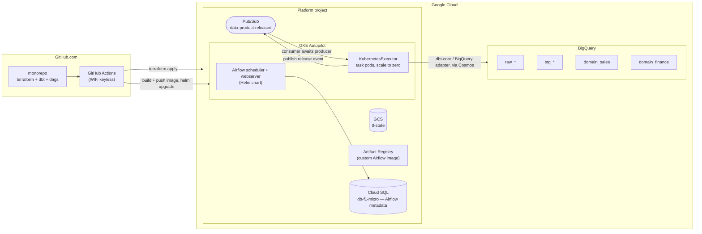
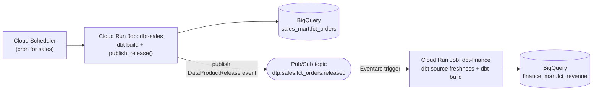

# Reference Data Transformation Platform on GCP — Implementation & Deployment Plan

## 0. Target architecture

> **Orchestrator choice:** this plan runs Airflow **self-hosted on GKE Autopilot** (Helm chart + `KubernetesExecutor`) as the primary path — only the scheduler/webserver pods run continuously, and task pods scale to zero between runs, which is materially cheaper than Cloud Composer for a weekend build. Composer remains fully viable and is documented as a drop-in managed alternative in Appendix A at the end of this document.



**Key design decisions (and why):**

| Decision | Choice | Rationale |
|---|---|---|
| Repo topology | **Monorepo now, path-scoped CI** | Weekend scope; per-domain folders are already "split-ready" — each domain can be extracted to its own repo later with zero refactoring. |
| Orchestrator | **Self-hosted Airflow on GKE Autopilot** (`KubernetesExecutor`); Cloud Composer documented as a managed alternative | No 24/7 Composer surcharge; task pods bill only while running — the right shape for bursty weekend usage. |
| dbt execution model | **astronomer-cosmos** inside the scheduler/worker pods (phase 1) → **one dbt image per domain via `ExecutionMode.KUBERNETES`** (phase 2) | Cosmos gives model-level task granularity + retries instantly. Container-per-domain is the autonomy end-state (independent dbt versions & packages). |
| Cross-domain sync | **Airflow Assets/Datasets** intra-instance + **Pub/Sub "data product released" events** cross-instance | Datasets = zero-code dependency scheduling. Pub/Sub = the contract that survives domain separation into different projects/Airflow instances. |
| GCP → GitHub auth | **Workload Identity Federation** (GitHub Actions) + **GKE Workload Identity** (in-cluster pods) | No service account JSON keys ever committed or stored. |
| Environments | `dev` + `prd`, separate GCP projects (or at minimum separate datasets + separate TF state prefixes) | Required for a meaningful CI/CD demo. |

> ⚠️ **Cost note:** the GKE path isn't free either — you pay for Autopilot scheduler/webserver pod requests, a `db-f1-micro` Cloud SQL instance, and task pods while they run. It's a fraction of Composer's 24/7 floor, but still `terraform destroy` Sunday night (Step 10) for zero ongoing spend between weekends.

---

## Phase 1 — Prerequisites and bootstrap (≈45 min)

### Step 1.1 — Decide identifiers

Fix these up front; they thread through everything:

```
ORG/BILLING      : <billing-account-id>
PROJECT (dev)    : dtp-ref-dev
PROJECT (prd)    : dtp-ref-prd
REGION           : europe-central2
GITHUB REPO      : <org>/data-transformation-platform
TF STATE BUCKET  : dtp-ref-tfstate           (created once, lives in dev project)
```

### Step 1.2 — Create projects and enable APIs

```bash
gcloud projects create dtp-ref-dev --name="DTP Reference Dev"
gcloud projects create dtp-ref-prd --name="DTP Reference Prod"

for P in dtp-ref-dev dtp-ref-prd; do
  gcloud beta billing projects link $P --billing-account=$BILLING
  gcloud services enable \
    container.googleapis.com sqladmin.googleapis.com bigquery.googleapis.com pubsub.googleapis.com \
    artifactregistry.googleapis.com iam.googleapis.com \
    cloudresourcemanager.googleapis.com storage.googleapis.com \
    iamcredentials.googleapis.com sts.googleapis.com \
    datacatalog.googleapis.com --project=$P
done
```

### Step 1.3 — Bootstrap Terraform state bucket (the only click-ops you allow yourself)

```bash
gcloud storage buckets create gs://dtp-ref-tfstate \
  --project=dtp-ref-dev --location=europe-central2 \
  --uniform-bucket-level-access
gcloud storage buckets update gs://dtp-ref-tfstate --versioning
```

### Step 1.4 — Workload Identity Federation for GitHub Actions

Bootstrap this with a small standalone Terraform stack (`infra/bootstrap/`) so it is still IaC:

```hcl
resource "google_iam_workload_identity_pool" "github" {
  workload_identity_pool_id = "github-pool"
}

resource "google_iam_workload_identity_pool_provider" "github" {
  workload_identity_pool_id          = google_iam_workload_identity_pool.github.workload_identity_pool_id
  workload_identity_pool_provider_id = "github-provider"
  attribute_mapping = {
    "google.subject"       = "assertion.sub"
    "attribute.repository" = "assertion.repository"
    "attribute.ref"        = "assertion.ref"
  }
  # Hard requirement: without attribute_condition the pool accepts ANY GitHub repo.
  attribute_condition = "assertion.repository == '<org>/data-transformation-platform'"
  oidc { issuer_uri = "https://token.actions.githubusercontent.com" }
}

# Two SAs: plan-only (PR) and apply (main)
resource "google_service_account" "tf_plan"  { account_id = "sa-tf-plan"  }
resource "google_service_account" "tf_apply" { account_id = "sa-tf-apply" }

resource "google_service_account_iam_member" "apply_wif" {
  service_account_id = google_service_account.tf_apply.name
  role               = "roles/iam.workloadIdentityUser"
  member             = "principalSet://iam.googleapis.com/${google_iam_workload_identity_pool.github.name}/attribute.repository/<org>/data-transformation-platform"
}
```

Grant `sa-tf-plan` → `roles/viewer`; `sa-tf-apply` → `roles/editor` + `roles/iam.securityAdmin` (tighten later). Restrict `sa-tf-apply` further by adding `attribute.ref == 'refs/heads/main'` conditions on the binding if you want a clean demo of least privilege.

---

## Phase 2 — Repository structure (≈20 min)

Design the layout so "extract a domain into its own repo" is a `git mv`, not a rewrite.

```
data-transformation-platform/
├── .github/
│   └── workflows/
│       ├── ci-terraform.yml
│       ├── ci-dbt.yml
│       └── cd-deploy.yml
├── infra/
│   ├── bootstrap/                  # WIF, state bucket, SAs  (applied once, manually)
│   ├── modules/
│   │   ├── bigquery_domain/        # datasets + IAM for one domain
│   │   ├── airflow_gke/            # GKE Autopilot cluster + Cloud SQL + Helm release
│   │   ├── data_product_topic/     # Pub/Sub topic + schema + subscriptions
│   │   └── domain_identity/        # per-domain SA + role bindings
│   └── envs/
│       ├── dev/{main.tf,backend.tf,terraform.tfvars}
│       └── prd/{main.tf,backend.tf,terraform.tfvars}
├── domains/
│   ├── sales/                      # ← autonomous unit
│   │   ├── dbt/                    # complete standalone dbt project
│   │   │   ├── dbt_project.yml
│   │   │   ├── profiles.yml
│   │   │   ├── packages.yml
│   │   │   ├── models/{staging,intermediate,marts}/
│   │   │   ├── macros/
│   │   │   ├── seeds/
│   │   │   └── tests/
│   │   ├── dags/
│   │   │   └── sales_daily_dag.py
│   │   ├── domain.yaml             # ← the domain contract manifest
│   │   └── infra.tf                # module calls for this domain only
│   └── finance/                    # second domain: consumes sales
│       └── ...
├── platform/
│   ├── dags_common/                # shared Airflow helpers (installed as plugin)
│   │   ├── data_product.py         # publish/await release events
│   │   └── cosmos_factory.py       # build_dbt_dag(domain) factory
│   ├── docker/
│   │   └── airflow/
│   │       └── Dockerfile          # apache/airflow base + cosmos + dbt-bigquery
│   ├── helm/
│   │   └── airflow/
│   │       ├── values-dev.yaml
│   │       └── values-prd.yaml
│   └── scripts/
│       ├── deploy_airflow.sh       # gcloud get-credentials + helm upgrade
│       └── validate_domain_manifest.py
├── .sqlfluff
├── .pre-commit-config.yaml
└── Makefile
```

The `domain.yaml` is the heart of the "future autonomous domains" requirement:

```yaml
# domains/sales/domain.yaml
domain: sales
owner: sales-data-team@example.com
schedule: "0 3 * * *"
dbt:
  project_dir: domains/sales/dbt
  target_dataset_prefix: sales
produces:                      # data products this domain publishes
  - name: fct_orders
    dataset: sales_mart
    table: fct_orders
    sla_minutes: 120
    topic: dtp.sales.fct_orders.released
consumes:                      # upstream products this domain waits for
  []
```

```yaml
# domains/finance/domain.yaml
domain: finance
schedule: null                 # event-driven only
produces:
  - name: fct_revenue
    dataset: finance_mart
    table: fct_revenue
    topic: dtp.finance.fct_revenue.released
consumes:
  - domain: sales
    product: fct_orders
    topic: dtp.sales.fct_orders.released
    max_staleness_hours: 26
```

Both CI (validation, dependency-graph rendering) and Terraform (via `yamldecode`) read this file — one source of truth.

---

## Phase 3 — Terraform: infrastructure modules (≈2 h)

### Step 3.1 — Backend & providers (`infra/envs/dev/backend.tf`)

```hcl
terraform {
  required_version = ">= 1.9"
  backend "gcs" {
    bucket = "dtp-ref-tfstate"
    prefix = "envs/dev"
  }
  required_providers {
    google = { source = "hashicorp/google", version = "~> 6.0" }
  }
}
```

### Step 3.2 — `modules/bigquery_domain`

One module invocation per domain per layer; keeps dataset naming and access uniform.

```hcl
variable "domain"      { type = string }
variable "env"         { type = string }
variable "location"    { type = string }
variable "layers"      { type = list(string), default = ["staging", "mart"] }
variable "reader_members" { type = list(string), default = [] }

resource "google_bigquery_dataset" "this" {
  for_each      = toset(var.layers)
  dataset_id    = "${var.domain}_${each.value}"
  location      = var.location
  description   = "Domain ${var.domain} — ${each.value} layer (${var.env})"
  delete_contents_on_destroy = var.env == "dev"

  labels = {
    domain = var.domain
    layer  = each.value
    env    = var.env
    managed_by = "terraform"
  }

  default_partition_expiration_ms = each.value == "staging" ? 7776000000 : null  # 90d on staging only
}

# Producer-owned write access; consumers only ever get reader on the mart layer.
resource "google_bigquery_dataset_iam_member" "domain_writer" {
  for_each   = google_bigquery_dataset.this
  dataset_id = each.value.dataset_id
  role       = "roles/bigquery.dataEditor"
  member     = "serviceAccount:${var.domain_sa_email}"
}

resource "google_bigquery_dataset_iam_member" "consumers" {
  for_each   = toset(var.reader_members)
  dataset_id = google_bigquery_dataset.this["mart"].dataset_id
  role       = "roles/bigquery.dataViewer"
  member     = each.value
}
```

### Step 3.3 — `modules/data_product_topic` (the synchronization backbone)

```hcl
resource "google_pubsub_schema" "release_event" {
  name = "data-product-release-v1"
  type = "AVRO"
  definition = file("${path.module}/release_event.avsc")
}

resource "google_pubsub_topic" "product" {
  name = var.topic_name                       # dtp.sales.fct_orders.released
  schema_settings {
    schema   = google_pubsub_schema.release_event.id
    encoding = "JSON"
  }
  message_retention_duration = "604800s"      # 7 days: lets a down consumer catch up
  labels = { domain = var.domain, product = var.product }
}

resource "google_pubsub_subscription" "consumer" {
  for_each = toset(var.consumer_domains)
  name     = "${var.topic_name}.sub.${each.value}"
  topic    = google_pubsub_topic.product.id
  ack_deadline_seconds       = 60
  message_retention_duration = "604800s"
  retain_acked_messages      = false
  expiration_policy { ttl = "" }              # never expire
  dead_letter_policy {
    dead_letter_topic     = google_pubsub_topic.dlq.id
    max_delivery_attempts = 10
  }
}
```

`release_event.avsc` — **this is your data contract**:

```json
{
  "type": "record", "name": "DataProductRelease",
  "fields": [
    {"name": "event_id",        "type": "string"},
    {"name": "domain",          "type": "string"},
    {"name": "product",         "type": "string"},
    {"name": "fq_table",        "type": "string"},
    {"name": "logical_date",    "type": "string"},
    {"name": "run_id",          "type": "string"},
    {"name": "dbt_invocation_id","type": "string"},
    {"name": "row_count",       "type": "long"},
    {"name": "status",          "type": {"type":"enum","name":"Status","symbols":["SUCCESS","PARTIAL","FAILED"]}},
    {"name": "published_at",    "type": "string"},
    {"name": "schema_version",  "type": "int"}
  ]
}
```

### Step 3.4 — `modules/airflow_gke` (self-hosted Airflow on GKE Autopilot)

A GKE Autopilot cluster + a small Cloud SQL metadata DB + a Helm release of the official Airflow chart, wired through GKE Workload Identity — no keys anywhere.

```hcl
resource "google_container_cluster" "airflow" {
  name                = "airflow-${var.env}"
  location            = var.region
  enable_autopilot    = true
  deletion_protection = false        # weekend project: teardown must be one command
  ip_allocation_policy {}            # required for Autopilot (VPC-native)
}

resource "google_sql_database_instance" "airflow_meta" {
  name                = "airflow-meta-${var.env}"
  database_version    = "POSTGRES_15"
  region              = var.region
  deletion_protection = false
  settings {
    tier              = "db-f1-micro"   # cheapest managed tier, fine for a demo
    availability_type = "ZONAL"
  }
}

resource "google_sql_database" "airflow" {
  name     = "airflow"
  instance = google_sql_database_instance.airflow_meta.name
}

resource "random_password" "airflow_db" {
  length  = 24
  special = false
}

resource "google_sql_user" "airflow" {
  name     = "airflow"
  instance = google_sql_database_instance.airflow_meta.name
  password = random_password.airflow_db.result
}

resource "google_service_account" "airflow_gsa" {
  account_id = "sa-airflow-${var.env}"
}

resource "google_project_iam_member" "airflow_roles" {
  for_each = toset([
    "roles/bigquery.jobUser",
    "roles/pubsub.publisher",
    "roles/pubsub.subscriber",
    "roles/cloudsql.client",
  ])
  project = var.project_id
  role    = each.value
  member  = "serviceAccount:${google_service_account.airflow_gsa.email}"
}

# Binds the in-cluster KSA to this GSA — GKE Workload Identity, no key ever leaves GCP.
resource "google_service_account_iam_member" "workload_identity" {
  service_account_id = google_service_account.airflow_gsa.name
  role                = "roles/iam.workloadIdentityUser"
  member              = "serviceAccount:${var.project_id}.svc.id.goog[airflow/airflow-scheduler]"
}

resource "helm_release" "airflow" {
  name             = "airflow"
  repository       = "https://airflow.apache.org"
  chart            = "airflow"
  version          = "1.16.0"          # chart's own default Airflow image is 2.10.5 here - matches the Dockerfile below
  namespace        = "airflow"
  create_namespace = true
  values           = [file("${path.module}/../../../platform/helm/airflow/values-${var.env}.yaml")]

  set_sensitive {
    name  = "data.metadataConnection.pass"
    value = random_password.airflow_db.result
  }

  depends_on = [google_container_cluster.airflow, google_sql_database.airflow, google_sql_user.airflow]
}

output "gke_cluster_name"  { value = google_container_cluster.airflow.name }
output "airflow_gsa_email" { value = google_service_account.airflow_gsa.email }
```

> Add the `hashicorp/random` and `helm` (`terraform-providers/helm`) providers to `required_providers` in `backend.tf` before planning this module.
>
> Chart `1.20.0`+ dropped support for Airflow versions below 2.11, so stay at `1.19.0` or lower while pinned to the `2.10.5` image below; bump the Dockerfile's base image before moving past that chart version.

`platform/helm/airflow/values-dev.yaml`:

```yaml
executor: KubernetesExecutor       # task pods scale to zero between runs
images:
  airflow:
    repository: europe-central2-docker.pkg.dev/dtp-ref-dev/dtp/airflow-dbt
    tag: latest                    # CI pins the real tag via `helm upgrade --set images.airflow.tag=<sha>`
webserver:
  replicas: 1
  resources: { requests: { cpu: "250m", memory: "512Mi" } }
scheduler:
  replicas: 1
  resources: { requests: { cpu: "250m", memory: "512Mi" } }
triggerer:
  enabled: false                   # enable only if you use deferrable sensors (PubSubPullSensor deferrable=True)
postgresql:
  enabled: false                   # use external Cloud SQL, not the chart's bundled Postgres
data:
  metadataConnection:
    protocol: postgresql
    host: 127.0.0.1                # via Cloud SQL Auth Proxy sidecar
    user: airflow
    db: airflow
    port: 5432
workers:
  resources: { requests: { cpu: "250m", memory: "512Mi" } }
dags:
  gitSync:
    enabled: true
    repo: https://github.com/<org>/data-transformation-platform.git
    branch: main
    subPath: "domains"
serviceAccount:
  create: true
  name: airflow-scheduler
  annotations:
    iam.gke.io/gcp-service-account: sa-airflow-dev@dtp-ref-dev.iam.gserviceaccount.com
```

`platform/docker/airflow/Dockerfile`:

```dockerfile
FROM apache/airflow:2.10.5-python3.11
RUN pip install --no-cache-dir \
    astronomer-cosmos==1.9.2 \
    dbt-bigquery==1.9.1 \
    dbt-core==1.9.3
```

> ⏱ GKE Autopilot cluster + Cloud SQL creation takes roughly 5–10 minutes — much faster than Composer, but still kick it off first while you build the dbt projects.

### Step 3.5 — Env composition (`infra/envs/dev/main.tf`)

Drive everything from `domain.yaml` so adding a domain = adding a folder:

```hcl
locals {
  domain_files = fileset("${path.module}/../../../domains", "*/domain.yaml")
  domains      = { for f in local.domain_files :
                   yamldecode(file("${path.module}/../../../domains/${f}")).domain =>
                   yamldecode(file("${path.module}/../../../domains/${f}")) }

  products = flatten([for d, cfg in local.domains :
              [for p in cfg.produces : merge(p, { domain = d })]])

  consumers_by_topic = { for t in distinct([for p in local.products : p.topic]) :
                          t => [for d, cfg in local.domains :
                                d if contains([for c in try(cfg.consumes, []) : c.topic], t)] }
}

module "domain_identity" {
  for_each = local.domains
  source   = "../../modules/domain_identity"
  domain   = each.key
  project_id = var.project_id
}

module "bigquery" {
  for_each        = local.domains
  source          = "../../modules/bigquery_domain"
  domain          = each.key
  env             = var.env
  location        = var.location
  domain_sa_email = module.domain_identity[each.key].sa_email
  reader_members  = [for d, cfg in local.domains :
                     "serviceAccount:${module.domain_identity[d].sa_email}"
                     if contains([for c in try(cfg.consumes, []) : c.domain], each.key)]
}

module "product_topic" {
  for_each         = { for p in local.products : p.topic => p }
  source           = "../../modules/data_product_topic"
  topic_name       = each.key
  domain           = each.value.domain
  product          = each.value.name
  consumer_domains = lookup(local.consumers_by_topic, each.key, [])
}
```

This is the single most important structural move: **the dependency graph between domains is declared in YAML and materialized as infrastructure**, so nothing is hand-wired.

---

## Phase 4 — dbt project (≈1.5 h)

### Step 4.1 — `domains/sales/dbt/dbt_project.yml`

```yaml
name: sales
version: "1.0.0"
config-version: 2
profile: sales

model-paths: ["models"]
target-path: "target"

vars:
  gcp_project: "{{ env_var('GCP_PROJECT') }}"
  dtp_env: "{{ env_var('DTP_ENV', 'dev') }}"

models:
  sales:
    +persist_docs: {relation: true, columns: true}
    staging:
      +materialized: view
      +schema: staging
    intermediate:
      +materialized: ephemeral
    marts:
      +materialized: incremental
      +incremental_strategy: insert_overwrite
      +partition_by: {field: order_date, data_type: date, granularity: day}
      +schema: mart
      +labels: {domain: sales, layer: mart}
```

### Step 4.2 — `profiles.yml` (keyless, uses GKE Workload Identity ADC)

```yaml
sales:
  target: "{{ env_var('DTP_ENV', 'dev') }}"
  outputs:
    dev:
      type: bigquery
      method: oauth               # Application Default Credentials
      project: "{{ env_var('GCP_PROJECT') }}"
      dataset: sales_staging
      location: "{{ env_var('DTP_BQ_LOCATION', 'europe-central2') }}"
      threads: 8
      priority: interactive
      job_execution_timeout_seconds: 900
      job_retries: 1
    prd:
      type: bigquery
      method: oauth
      project: "{{ env_var('GCP_PROJECT') }}"
      dataset: sales_staging
      location: "{{ env_var('DTP_BQ_LOCATION', 'europe-central2') }}"
      threads: 16
    ci:
      type: bigquery
      method: oauth
      project: "{{ env_var('GCP_PROJECT') }}"
      dataset: "ci_pr_{{ env_var('PR_NUMBER', '0') }}"
      threads: 8
```

### Step 4.3 — `macros/generate_schema_name.sql`

Prevents dbt's default `<target_schema>_<custom_schema>` concatenation:

```sql

    
        {{ target.schema }}
    
        {{ project_name }}_{{ custom_schema_name | trim }}
    

```

### Step 4.4 — Cross-domain consumption: sources, never direct refs

`domains/finance/dbt/models/staging/_sources.yml`:

```yaml
version: 2
sources:
  - name: sales               # the contract boundary
    project: "{{ env_var('GCP_PROJECT') }}"
    schema: sales_mart
    tables:
      - name: fct_orders
        loaded_at_field: _dbt_loaded_at
        freshness:
          warn_after:  {count: 26, period: hour}
          error_after: {count: 48, period: hour}
```

**Rule to enforce in CI:** a domain may only `source()` another domain's `mart` layer, never `ref()` across domains. This is what makes later repo extraction mechanical.

### Step 4.5 — Reference models to build (minimal but realistic)

```
sales/models/
  staging/stg_orders.sql          (from a public dataset or a seed)
  staging/stg_customers.sql
  intermediate/int_orders_enriched.sql
  marts/fct_orders.sql            ← data product, incremental + partitioned
  marts/_schema.yml               ← tests: unique, not_null, relationships
finance/models/
  staging/stg_sales_orders.sql    ← source('sales','fct_orders')
  marts/fct_revenue.sql           ← data product
```

Use `bigquery-public-data.thelook_ecommerce` as the raw source so you have real data on day one, and add a `seeds/` CSV for dimension lookups to prove the seed path works.

---

## Phase 5 — Airflow DAGs with Cosmos (≈1.5 h)

### Step 5.1 — DAG factory (`platform/dags_common/cosmos_factory.py`)

```python
from pathlib import Path
import yaml
from cosmos import DbtTaskGroup, ProjectConfig, ProfileConfig, ExecutionConfig, RenderConfig, LoadMode

# git-sync mounts the repo here; "domains" is the subPath configured in values-<env>.yaml.
DAGS_ROOT = Path("/opt/airflow/dags/repo/domains")

def load_manifest(domain: str) -> dict:
    return yaml.safe_load((DAGS_ROOT / domain / "domain.yaml").read_text())

def dbt_task_group(domain: str, select: list[str] | None = None) -> DbtTaskGroup:
    project_dir = DAGS_ROOT / domain / "dbt"
    return DbtTaskGroup(
        group_id=f"dbt_{domain}",
        project_config=ProjectConfig(
            dbt_project_path=project_dir,
            # Parse from a pre-compiled manifest: avoids running `dbt ls` on every scheduler loop.
            manifest_path=project_dir / "target" / "manifest.json",
        ),
        profile_config=ProfileConfig(
            profile_name=domain,
            target_name="{{ var.value.get('dtp_env', 'dev') }}",
            profiles_yml_filepath=project_dir / "profiles.yml",
        ),
        execution_config=ExecutionConfig(
            dbt_executable_path="/home/airflow/.local/bin/dbt",   # baked into the custom image, see platform/docker/airflow
        ),
        render_config=RenderConfig(
            load_method=LoadMode.DBT_MANIFEST,
            select=select or [],
            test_behavior="after_each",
        ),
        operator_args={"install_deps": False, "full_refresh": False},
        default_args={"retries": 2},
    )
```

### Step 5.2 — Release-event publisher (`platform/dags_common/data_product.py`)

```python
import json, uuid, datetime
from airflow.decorators import task
from google.cloud import pubsub_v1, bigquery

@task
def publish_release(domain: str, product: dict, **context):
    """Emit the contract event AFTER the product table is committed."""
    bq = bigquery.Client()
    fq = f"{product['project']}.{product['dataset']}.{product['table']}"
    rows = bq.get_table(fq).num_rows

    payload = {
        "event_id": str(uuid.uuid4()),
        "domain": domain,
        "product": product["name"],
        "fq_table": fq,
        "logical_date": context["logical_date"].isoformat(),
        "run_id": context["run_id"],
        "dbt_invocation_id": context["ti"].xcom_pull(key="dbt_invocation_id") or "",
        "row_count": rows,
        "status": "SUCCESS",
        "published_at": datetime.datetime.utcnow().isoformat() + "Z",
        "schema_version": 1,
    }
    publisher = pubsub_v1.PublisherClient()
    topic = publisher.topic_path(product["gcp_project"], product["topic"])
    publisher.publish(
        topic, json.dumps(payload).encode(),
        domain=domain, product=product["name"],
        logical_date=payload["logical_date"],   # attributes → server-side filtering
    ).result(timeout=30)
    return payload
```

### Step 5.3 — Producer DAG (`domains/sales/dags/sales_daily_dag.py`)

```python
from airflow.decorators import dag
from airflow.datasets import Dataset
from pendulum import datetime
from dags_common.cosmos_factory import dbt_task_group, load_manifest
from dags_common.data_product import publish_release

MANIFEST = load_manifest("sales")
FCT_ORDERS = Dataset("bigquery://sales_mart/fct_orders")

@dag(
    dag_id="sales__daily",
    schedule=MANIFEST["schedule"],
    start_date=datetime(2026, 9, 1, tz="UTC"),
    catchup=False,
    max_active_runs=1,
    tags=["domain:sales", "layer:mart", "producer"],
)
def sales_daily():
    dbt = dbt_task_group("sales")
    # Dual signalling: Dataset for same-instance consumers, Pub/Sub for cross-instance/cross-project.
    notify = publish_release.override(outlets=[FCT_ORDERS])(
        domain="sales", product=MANIFEST["produces"][0]
    )
    dbt >> notify

sales_daily()
```

### Step 5.4 — Consumer DAG, two synchronization modes

**Mode A — same Airflow instance (simplest, use now):**

```python
@dag(dag_id="finance__on_sales", schedule=[FCT_ORDERS], catchup=False, start_date=...)
def finance_on_sales():
    dbt_task_group("finance")
```

Airflow triggers `finance__on_sales` the moment `sales__daily` updates the asset. No sensors, no polling, no cost.

**Mode B — cross-instance / future separate domain project (the scalable one):**

```python
from airflow.providers.google.cloud.sensors.pubsub import PubSubPullSensor

@dag(dag_id="finance__event_driven", schedule="@daily", catchup=False, start_date=...)
def finance_event_driven():
    wait = PubSubPullSensor(
        task_id="await_sales_fct_orders",
        project_id="{{ var.value.gcp_project }}",
        subscription="dtp.sales.fct_orders.released.sub.finance",
        max_messages=10,
        ack_messages=True,
        deferrable=True,                    # frees the worker slot entirely
        timeout=6 * 60 * 60,
        poke_interval=60,
    )
    validate = validate_freshness(max_staleness_hours=26)   # guard against stale replays
    wait >> validate >> dbt_task_group("finance")
```

**Belt-and-braces third check** — even with events, add a `dbt source freshness` gate at the start of every consumer run:

```bash
dbt source freshness --select source:sales
```

This turns "the producer said it was done" into "the data actually is fresh", which is what you want when the event bus has an outage.

### Step 5.5 — Idempotency and late/duplicate events

Pub/Sub is at-least-once. Guard with:
- `ack_messages=True` + a BigQuery `_dtp_processed_events` table keyed on `event_id`, checked in `validate_freshness`.
- Filter on message attribute `logical_date` so a consumer run only accepts events for its own logical date.
- `max_active_runs=1` on every domain DAG.

---

## Phase 6 — CI/CD with GitHub Actions (≈2 h)

Three workflows, all keyless via WIF.

### Step 6.1 — `ci-terraform.yml` (PR: plan / main: apply)

```yaml
name: ci-terraform
on:
  pull_request: { paths: ["infra/**", "domains/**/domain.yaml"] }
  push:         { branches: [main], paths: ["infra/**", "domains/**/domain.yaml"] }

permissions: { contents: read, id-token: write, pull-requests: write }

jobs:
  terraform:
    strategy: { matrix: { env: [dev, prd] } }
    runs-on: ubuntu-latest
    steps:
      - uses: actions/checkout@v4
      - uses: google-github-actions/auth@v2
        with:
          workload_identity_provider: ${{ secrets.WIF_PROVIDER }}
          service_account: ${{ github.event_name == 'push' && secrets.SA_TF_APPLY || secrets.SA_TF_PLAN }}
      - uses: hashicorp/setup-terraform@v3
        with: { terraform_version: 1.9.8 }
      - run: python platform/scripts/validate_domain_manifest.py domains/
      - run: terraform -chdir=infra/envs/${{ matrix.env }} init
      - run: terraform -chdir=infra/envs/${{ matrix.env }} fmt -check -recursive
      - run: terraform -chdir=infra/envs/${{ matrix.env }} validate
      - run: terraform -chdir=infra/envs/${{ matrix.env }} plan -out=tf.plan -no-color
      - if: github.event_name == 'push' && matrix.env == 'dev'
        run: terraform -chdir=infra/envs/dev apply -auto-approve tf.plan
      - if: github.event_name == 'push' && matrix.env == 'prd'
        run: echo "prd apply gated by GitHub Environment approval"
        # attach `environment: production` to this job for manual approval
```

### Step 6.2 — `ci-dbt.yml` (PR gate — the important one)

Uses **Slim CI**: build only what changed, against a PR-scoped dataset.

```yaml
name: ci-dbt
on:
  pull_request: { paths: ["domains/**/dbt/**"] }

permissions: { contents: read, id-token: write }

jobs:
  detect:
    runs-on: ubuntu-latest
    outputs: { domains: ${{ steps.f.outputs.domains }} }
    steps:
      - uses: actions/checkout@v4
        with: { fetch-depth: 0 }
      - id: f
        run: |
          CHANGED=$(git diff --name-only origin/${{ github.base_ref }}...HEAD \
            | grep '^domains/' | cut -d/ -f2 | sort -u | jq -R . | jq -sc .)
          echo "domains=$CHANGED" >> $GITHUB_OUTPUT

  build:
    needs: detect
    if: needs.detect.outputs.domains != '[]'
    strategy: { matrix: { domain: ${{ fromJson(needs.detect.outputs.domains) }} } }
    runs-on: ubuntu-latest
    env:
      GCP_PROJECT: dtp-ref-dev
      DTP_ENV: ci
      PR_NUMBER: ${{ github.event.pull_request.number }}
    steps:
      - uses: actions/checkout@v4
      - uses: google-github-actions/auth@v2
        with:
          workload_identity_provider: ${{ secrets.WIF_PROVIDER }}
          service_account: ${{ secrets.SA_DBT_CI }}
      - uses: actions/setup-python@v5
        with: { python-version: "3.11" }
      - run: pip install dbt-bigquery==1.9.1 sqlfluff sqlfluff-templater-dbt
      - working-directory: domains/${{ matrix.domain }}/dbt
        run: |
          dbt deps
          dbt parse                                   # fails fast on compile errors
          sqlfluff lint models --templater dbt
          # Slim CI: production manifest as the deferral baseline
          gsutil cp gs://dtp-ref-artifacts/manifests/${{ matrix.domain }}/prd/manifest.json ./prod_manifest/ || true
          dbt build --target ci \
            --select state:modified+ --defer --state ./prod_manifest \
            --fail-fast
      - name: Drop PR dataset
        if: always()
        run: bq rm -r -f -d dtp-ref-dev:ci_pr_${PR_NUMBER} || true
```

Add a `pr-closed.yml` that drops `ci_pr_<n>` on PR close as a safety net, plus a `default_table_expiration_ms` on CI datasets so orphans self-clean.

### Step 6.3 — `cd-deploy.yml` (main → GKE via Helm)

```yaml
name: cd-deploy
on: { push: { branches: [main], paths: ["domains/**", "platform/**"] } }

permissions: { contents: read, id-token: write }

jobs:
  deploy:
    strategy: { max-parallel: 1, matrix: { env: [dev, prd] } }
    environment: ${{ matrix.env }}          # prd requires manual approval
    runs-on: ubuntu-latest
    steps:
      - uses: actions/checkout@v4
      - uses: google-github-actions/auth@v2
        with:
          workload_identity_provider: ${{ secrets.WIF_PROVIDER }}
          service_account: ${{ secrets.SA_DEPLOY }}
      - uses: actions/setup-python@v5
        with: { python-version: "3.11" }
      - run: pip install dbt-bigquery==1.9.1

      # 1. Compile each domain -> produces target/manifest.json used by Cosmos at parse time
      - name: Compile dbt manifests
        run: |
          for d in domains/*/; do
            (cd $d/dbt && dbt deps && dbt compile --target ${{ matrix.env }} --no-version-check)
          done
        env: { GCP_PROJECT: "dtp-ref-${{ matrix.env }}", DTP_ENV: "${{ matrix.env }}" }

      # 2. Build & push the custom Airflow image — DAGs themselves are pulled live by git-sync, no rsync needed
      - uses: google-github-actions/setup-gcloud@v2
      - name: Build and push Airflow image
        run: |
          gcloud auth configure-docker europe-central2-docker.pkg.dev --quiet
          IMAGE=europe-central2-docker.pkg.dev/dtp-ref-${{ matrix.env }}/dtp/airflow-dbt:${{ github.sha }}
          docker build -t $IMAGE -f platform/docker/airflow/Dockerfile platform/docker/airflow
          docker push $IMAGE

      # 3. Point Helm at the cluster Terraform created, and roll out the new image tag
      - name: Helm upgrade
        run: |
          gcloud container clusters get-credentials airflow-${{ matrix.env }} \
            --region europe-central2 --project dtp-ref-${{ matrix.env }}
          helm upgrade airflow apache-airflow/airflow \
            --namespace airflow --reuse-values \
            --set images.airflow.repository=europe-central2-docker.pkg.dev/dtp-ref-${{ matrix.env }}/dtp/airflow-dbt \
            --set images.airflow.tag=${{ github.sha }} \
            --wait --timeout 10m

      # 4. Publish the production manifest for the next PR's Slim CI
      - name: Publish manifests
        if: matrix.env == 'prd'
        run: |
          for d in domains/*/; do
            n=$(basename $d)
            gcloud storage cp $d/dbt/target/manifest.json \
              gs://dtp-ref-artifacts/manifests/$n/prd/manifest.json
          done

      - name: Smoke test — DAGs import cleanly
        run: |
          kubectl -n airflow rollout status deployment/airflow-scheduler --timeout=300s
          kubectl -n airflow exec deploy/airflow-scheduler -- \
            airflow dags list-import-errors 2>&1 | tee errs.txt
          grep -q "No data found" errs.txt || (cat errs.txt && exit 1)
```

### Step 6.4 — Branch protection & pre-commit

- `main` protected: require `ci-terraform`, `ci-dbt`, 1 review, linear history.
- `.pre-commit-config.yaml`: `terraform_fmt`, `terraform_validate`, `sqlfluff-lint`, `check-yaml`, `detect-secrets`, plus a local hook running `validate_domain_manifest.py`.

---

## Phase 7 — Deployment runbook (order matters)

Execute exactly in this order:

| # | Action | Where | Notes |
|---|---|---|---|
| 1 | Create projects, enable APIs, create state bucket | local `gcloud` | one-time |
| 2 | `terraform apply` in `infra/bootstrap/` | local | creates WIF pool, provider, CI service accounts |
| 3 | Add repo secrets `WIF_PROVIDER`, `SA_TF_PLAN`, `SA_TF_APPLY`, `SA_DBT_CI`, `SA_DEPLOY` | GitHub | values are TF outputs |
| 4 | Push `infra/envs/dev` → merge | GitHub | **starts GKE Autopilot cluster + Cloud SQL creation (~5–10 min)** |
| 5 | While waiting: build dbt models, run `dbt build --target dev` locally | local | validates BQ access + SQL |
| 6 | Create GitHub Environments `dev` / `prd`, add reviewer on `prd` | GitHub | gates prod apply |
| 7 | Merge domains + platform code → `cd-deploy` runs | GitHub | builds/pushes image, `helm upgrade`, compiles manifests |
| 8 | Unpause `sales__daily` in the Airflow UI (`kubectl -n airflow port-forward svc/airflow-webserver 8080:8080`) | GKE | `dags_are_paused_at_creation=True` by design |
| 9 | Trigger `sales__daily` manually | GKE | verify each dbt model is a separate task pod, and it scales to zero after |
| 10 | Confirm `finance__on_sales` auto-triggers | GKE | **proves the Dataset-based sync** |
| 11 | Confirm Pub/Sub message landed | `gcloud pubsub subscriptions pull` | **proves the cross-project contract** |
| 12 | Open a PR touching one model → observe Slim CI | GitHub | proves `state:modified+ --defer` |
| 13 | Apply `infra/envs/prd`, approve, deploy | GitHub | full promotion path |

---

## Phase 8 — Validation checklist

Run these to prove each requirement is met:

```bash
# IaC: zero drift after deploy
terraform -chdir=infra/envs/dev plan -detailed-exitcode   # expect exit 0

# BigQuery: partitioning and labels actually applied
bq show --format=prettyjson dtp-ref-dev:sales_mart.fct_orders | jq '.timePartitioning, .labels'

# dbt: full graph builds + tests pass
cd domains/sales/dbt && dbt build --target dev && dbt test

# Airflow: producer → consumer chain
kubectl -n airflow exec deploy/airflow-scheduler -- airflow dags list --tags domain:finance

# Synchronization: event published with correct contract
gcloud pubsub subscriptions pull dtp.sales.fct_orders.released.sub.finance --auto-ack --limit 1

# Freshness contract holds
cd domains/finance/dbt && dbt source freshness --select source:sales
```

---

## Phase 9 — How this scales to autonomous domain projects

You built it split-ready. The migration path, when domain teams want independence:

1. **`git filter-repo` the `domains/<name>/` folder** into its own repo. The dbt project, DAGs, `domain.yaml` and `infra.tf` move as a unit — nothing in them references the monorepo root.
2. **Switch execution from a shared Airflow image to container-per-domain.** Each domain repo builds its own `europe-central2-docker.pkg.dev/<proj>/dtp/dbt-<domain>:<sha>` image in CI; Cosmos's `ExecutionConfig` swaps from the baked-in dbt binary to `ExecutionMode.KUBERNETES`, launching one pod per dbt invocation from that domain's own image. Domains then own their dbt version and packages independently of the shared scheduler/worker image — a one-line config change, since `KubernetesExecutor` on GKE is already the baseline.
3. **Switch sync from Datasets to Pub/Sub only** (Mode B above). Datasets don't cross Airflow instances; the Pub/Sub contract already does, and you wrote both from day one so the cutover is deleting the `schedule=[Dataset]` line.
4. **Move the contract manifests to a registry.** Publish `domain.yaml` products to a central `data_products` BigQuery table (or Dataplex/Data Catalog entries) so consumers discover producers without reading another team's repo.
5. **Separate GCP projects per domain**, with only `roles/bigquery.dataViewer` on mart datasets granted cross-project, plus Authorized Views/Datasets where column-level restriction is needed. The `modules/bigquery_domain` reader wiring already models this.

---

## Phase 10 — Teardown (do this Sunday night)

```bash
terraform -chdir=infra/envs/prd destroy
terraform -chdir=infra/envs/dev destroy     # GKE Autopilot cluster + Cloud SQL, ~5-10 min
# keep bootstrap (WIF) and the state bucket — cheap, and lets you rebuild in one workflow run
```

Deleting the GKE cluster takes the Helm release, all task pods, and the scheduler/webserver with it — no separate `helm uninstall` needed. Because everything except the state bucket and WIF is in Terraform, rebuilding next weekend is one `terraform apply` plus one `cd-deploy` run. That is the real deliverable of this project.

---

## Weekend timebox

| Slot | Work |
|---|---|
| Sat AM (3 h) | Phases 1–3: bootstrap, repo skeleton, **GKE/Cloud SQL apply started first** |
| Sat PM (3 h) | Phase 4: dbt projects for `sales` + `finance`, local `dbt build` green |
| Sat eve (2 h) | Phase 5: Cosmos DAG factory, producer/consumer DAGs, release publisher |
| Sun AM (3 h) | Phase 6: three GitHub Actions workflows, WIF secrets, branch protection |
| Sun PM (2 h) | Phases 7–8: end-to-end deploy + validation checklist |
| Sun eve (1 h) | README/ADR notes, Phase 10 teardown |

## Highest-risk items (budget buffer here)

1. **GKE Workload Identity binding** — a wrong `serviceAccount` / `iam.gke.io/gcp-service-account` annotation pairing fails silently as a 403 from BigQuery/Pub-Sub inside the pod, not at `terraform apply` time. Verify with `kubectl -n airflow exec deploy/airflow-scheduler -- gcloud auth list` right after the first Helm install.
2. **git-sync auth to a private GitHub repo** — needs a deploy key or PAT wired into a Kubernetes secret referenced by the Helm chart's `dags.gitSync.credentialsSecret`; budget time for this on first setup even though it's a one-time cost.
3. **Cosmos + dbt version pinning** — mismatched `astronomer-cosmos` / `dbt-core` versions in `platform/docker/airflow/Dockerfile` fail at image-build time, not plan time. Pin exact versions and validate the combo locally in a venv before baking the image.
4. **Scheduler parse performance** — always ship a pre-compiled `manifest.json` and use `LoadMode.DBT_MANIFEST`; `dbt ls` at parse time will make small scheduler pod resources unusable.
5. **WIF `attribute_condition`** — omit it and your GitHub Actions pool trusts every repo on GitHub. Non-negotiable.

---

## Appendix A — Cloud Composer as a managed alternative

If you'd rather not operate Airflow yourself (Helm upgrades, image builds, Postgres backups), swap `modules/airflow_gke` for this Composer module — nothing else in the plan changes: dbt projects, `domain.yaml` contracts, Cosmos DAGs, and the Pub/Sub sync are all orchestrator-agnostic.

### `modules/composer`

```hcl
resource "google_service_account" "composer" {
  account_id   = "sa-composer-${var.env}"
  display_name = "Composer ${var.env} runtime"
}

resource "google_project_iam_member" "composer_worker" {
  for_each = toset([
    "roles/composer.worker",
    "roles/bigquery.jobUser",
    "roles/pubsub.publisher",
    "roles/pubsub.subscriber",
  ])
  project = var.project_id
  role    = each.value
  member  = "serviceAccount:${google_service_account.composer.email}"
}

resource "google_composer_environment" "this" {
  name   = "dtp-${var.env}"
  region = var.region

  config {
    software_config {
      image_version = "composer-3-airflow-2.10.5-build.0"
      pypi_packages = {
        "astronomer-cosmos" = "==1.9.2"
        "dbt-bigquery"      = "==1.9.1"
        "dbt-core"          = "==1.9.3"
      }
      env_variables = {
        DBT_PROFILES_DIR         = "/home/airflow/gcs/dags/dbt_profiles"
        GCP_PROJECT              = var.project_id
        DTP_ENV                  = var.env
        AIRFLOW_VAR_DTP_BQ_LOCATION = var.location
      }
      airflow_config_overrides = {
        "core-dags_are_paused_at_creation" = "True"
        "scheduler-min_file_process_interval" = "60"
      }
    }

    workloads_config {
      scheduler { cpu = 0.5, memory_gb = 2,  storage_gb = 1, count = 1 }
      web_server{ cpu = 0.5, memory_gb = 2,  storage_gb = 1 }
      worker    { cpu = 0.5, memory_gb = 2,  storage_gb = 10, min_count = 1, max_count = 3 }
    }

    environment_size = "ENVIRONMENT_SIZE_SMALL"
    node_config { service_account = google_service_account.composer.email }
  }
  timeouts { create = "60m", update = "60m" }
}

output "dag_gcs_prefix" { value = google_composer_environment.this.config[0].dag_gcs_prefix }
output "airflow_uri"    { value = google_composer_environment.this.config[0].airflow_uri }
```

DAG sync becomes the `gcloud storage rsync` step from the original `cd-deploy.yml` (resolve `dag_gcs_prefix` from the Terraform output, rsync `platform/dags_common` and `domains/*/dags` into it) instead of git-sync + Helm.

### Cost comparison

| | Cloud Composer 3 (small) | Self-hosted Airflow on GKE Autopilot |
|---|---|---|
| Idle floor | Fixed Composer surcharge + 24/7 scheduler/webserver — roughly $300–450/mo even at zero task volume (verify current figures in the GCP pricing calculator) | Scheduler+webserver pod requests + `db-f1-micro` — a small fraction of that |
| Task cost | Sized worker pool runs regardless of concurrency | `KubernetesExecutor`: billed per task-pod-second only while running |
| Rebuild time | 20–40 min | ~5–10 min |
| Ops burden | Google-managed upgrades/HA | You own Helm chart bumps, image builds, Postgres backups |
| Best for | Demonstrating the managed GCP orchestrator specifically | Minimizing weekend cost while still learning Airflow + IaC + GKE |

---

## Appendix B — Serverless alternatives to Airflow for orchestrating dbt

If the goal shifts from "demonstrate Airflow" to "minimize cost and ops to the absolute floor," none of the above needs a scheduler or webserver running at all. These options replace `modules/airflow_gke` (and Appendix A's Composer module) entirely; `modules/data_product_topic`, the AVRO contract, and every dbt project are untouched, since they were designed to be orchestrator-agnostic.

### Option comparison

| Option | How dbt runs | Cross-domain sync fit | Cost/ops profile |
|---|---|---|---|
| **Eventarc + Cloud Run Jobs** | A Cloud Run Job runs `dbt build` for one domain | Eventarc triggers the consumer's Job **directly off the existing Pub/Sub topic** — no polling, no sensor | Cheapest: zero idle cost, pure event-driven, no cluster/VM ever running |
| **Cloud Workflows + Cloud Run Jobs** | Workflows YAML calls `run.googleapis.com/.../jobs:run` per domain, in sequence/parallel | Workflows can `await` a Pub/Sub message natively | Serverless, pay-per-step — no idle floor |
| **Cloud Scheduler + Cloud Run Jobs** | Scheduler cron triggers one Job per domain | None built-in — needs Eventarc/a Pub/Sub-triggered function bolted on | Near-zero cost; time-based only, not event-driven |
| **GKE CronJob (no Airflow)** | Kubernetes `CronJob` runs the existing custom dbt image on a schedule | Same as above | Cheaper than Airflow-on-GKE, but no DAG history/UI |
| **Dataform** | GCP's native BigQuery transformation service (not dbt) | Own scheduling; cross-domain waits still need Workflows/Eventarc glue | Fully managed, zero compute to provision — but abandons dbt |

### Recommended shape: Eventarc + Cloud Run Jobs

This is the only option with **no orchestrator running between events** — it reuses the plan's existing contract as-is:



What changes versus the GKE/Composer paths:
- The **producer** becomes a Cloud Run Job (built from the same `platform/docker/airflow/Dockerfile`-style image, minus the Airflow layer) triggered by Cloud Scheduler instead of a DAG's `schedule`.
- The **consumer's `PubSubPullSensor`** is replaced by an **Eventarc trigger** (`google.cloud.pubsub.topic.v1.messagePublished`) pointed at the consumer's Cloud Run Job — the job starts itself on message arrival.
- The `dbt source freshness --select source:sales` gate moves from a dedicated Airflow task into the Job's entrypoint script, run before `dbt build`.
- Idempotency (Step 5.5's `_dtp_processed_events` table, `logical_date` filtering) still applies — Pub/Sub's at-least-once delivery guarantee doesn't change.

What you give up: per-dbt-model task granularity and retries in a UI, native backfill/catchup, and any single-pane view of run history beyond Cloud Logging.

**When to pick this over Airflow-on-GKE:** if the weekend project's goal is proving out the cross-domain data contract and IaC discipline at the lowest possible cost, rather than demonstrating Airflow itself.
